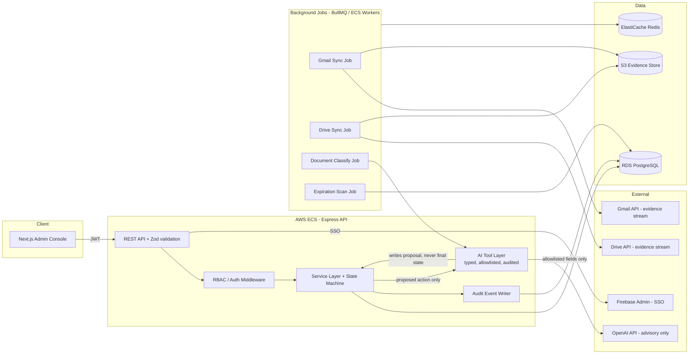
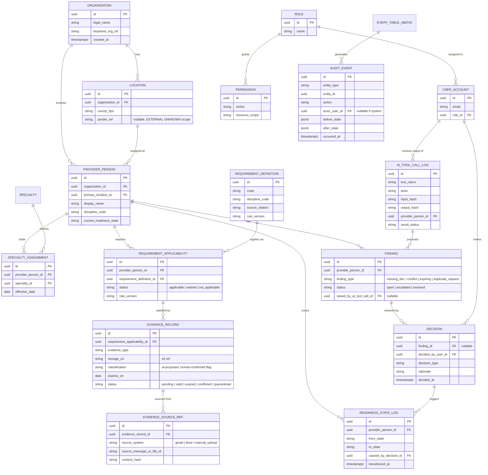

# Keystone AI Provider Onboarding & Readiness — Phase 0 Response

**Prepared by:** Arshad Ali Lagari
**In response to:** Keystone AI Provider Onboarding & Readiness, Consolidated Developer Execution Packet v3.0 (Effective Date 2026-08-24)
**Document status:** Draft for internal review before submission — not yet sent to client
**Purpose:** This is a discovery and planning response only, as instructed. It is **not** a commitment to build the full platform and does **not** authorize Phase 1 or later. It proposes architecture, a Phase 0 + Katherine bottom-up estimate, and records every open question rather than resolving it silently, per the packet's own controlling rule (Packet p.1, "Precedence").

---

## 0. How to read this document

Following the packet's own vocabulary (Packet p.1) so terminology stays consistent with the client's controlling document:

- **MUST/MUST NOT** — acceptance requirement
- **SHOULD** — expected unless a written deviation exists
- **MAY** — optional
- **TBD** — a named decision is required before dependent work can start
- **EXTERNAL UNKNOWN** — needs authoritative evidence from Keystone/ChildLink/Elwyn/county before it can become a production rule
- **ASSUMPTION** — a working assumption we are making now, subject to client confirmation

Every item below is tagged with one of these so the client can scan for what actually blocks work.

---

## 1. Gap, Question, Dependency & Assumptions Register

| ID | Type | Item | Related Spec(s) | Decision Needed From | Impact if Unresolved |
|---|---|---|---|---|---|
| G-01 | ASSUMPTION | We propose self-managed PostgreSQL (AWS RDS) + a custom Node/Express/Prisma backend instead of Supabase/Supabase Auth/RLS listed as "preferred" in the job posting. RLS-equivalent enforcement is done at the application/service layer plus DB constraints. | Spec 71 (RBAC/SoD) | Keystone product owner | If Supabase is a hard requirement (not just a preference) for operational reasons, this changes Phase 0 architecture and estimate. |
| G-02 | TBD | Full original v3.0 PDF ("one self-contained PDF containing specifications 00-83") vs. the reconstructed packet we received — the packet's own "Reconstruction notice" states this edition was rebuilt after the original workspace artifact became unavailable. Several domain specs (34-67: PROMISe/HCSIS, county/joinder overlays, CPSL clearances, fee schedules) currently carry generic boilerplate rather than PA-EI-specific detail. | All specs 34-67 | Keystone | Estimate for Phase 2+ cannot be trusted until we know whether domain-specific detail exists in the original PDF or must be authored jointly during Phase 0/1. |
| G-03 | EXTERNAL UNKNOWN | ChildLink system: API/integration availability, auth model, data contract, rate limits, sandbox/test environment. | Spec 76 | ChildLink / Keystone contract owner | No integration design or estimate possible; Phase 3+ blocked without this. |
| G-04 | EXTERNAL UNKNOWN | Elwyn system: same as above (API, auth, contract, test env). | Spec 76 | Elwyn / Keystone contract owner | Same as G-03. |
| G-05 | EXTERNAL UNKNOWN | County and joinder-specific overlay rules (which counties, what local variations, who ratifies them). | Spec 36, 64 | Keystone / county programs | Phase 2 "nine-provider generalization" cannot be scoped without knowing how many distinct overlays exist. |
| G-06 | EXTERNAL UNKNOWN | PROMISe enrollment, ITF Waiver, and HCSIS workflow specifics — is this read-only lookup, manual reconciliation, or an API integration? | Spec 35 | Keystone / PA DHS program contacts | Directly affects whether Phase 2/3 needs a new integration or a manual evidence-upload workflow. |
| G-07 | TBD | Google Workspace admin access: will Keystone provide a Google Workspace domain with domain-wide delegation for Gmail API + Drive API scoped service access, or do we integrate via individual OAuth per operator? | Spec 08, 09 | Keystone IT/security | Changes both architecture (service account vs. per-user OAuth) and the RBAC/audit model. |
| G-08 | ASSUMPTION | "Katherine" is one fully synthetic provider record (no real PHI/PII) used as the deterministic acceptance fixture per Spec 04/24/82. We assume Keystone will supply or approve the synthetic data content; we do not want to author clinical/legal fixture content unilaterally. | Spec 04, 24, 82 | Keystone Product/Operations | Katherine fixture cannot be finalized without an agreed source for its contents. |
| G-09 | TBD | Authoritative source for PA EI policy citations (Spec 63) — is there an existing internal register, or do we build the Policy Decision and Ratification Register (Spec 43) from zero in Phase 0? | Spec 43, 63 | Keystone Product/Operations | Affects Phase 0 scope/estimate materially. |
| G-10 | ASSUMPTION | No production data or real PHI will be provided during Phase 0/1 (confirmed in job posting). We will build and test exclusively against synthetic fixtures until an explicit, signed authorization changes this. | Spec 03, 10 | — | None if this assumption holds; flags a scope change if it doesn't. |
| G-11 | TBD | Hosting/account ownership: packet requires developer to "work inside accounts/repositories owned by the client." Please confirm Keystone will provision the AWS account, GitHub org, and Google Workspace project so IAM/least-privilege can be set up correctly from day one rather than migrated later. | Spec 14, 71 | Keystone IT | Late account handoff typically forces a costly access-migration pass before go-live. |
| G-12 | TBD | Definition of "operator" headcount and expected concurrent usage (for RDS sizing, Redis sizing, rate-limit tuning, cost estimate). | Spec 25 (NFR) | Keystone Operations | Cost register (Section 11) is a rough order of magnitude without this. |

---

## 2. Proposed Technical Architecture & Stack

### 2.1 Principle carried through from the packet

The system stays **deterministic beneath the AI layer** (Packet "Controlling boundary", Spec 00, 03, 05, 69). Concretely: every consequential state change happens through a typed service-layer function backed by a DB constraint and an audit event — never directly from an LLM response. AI output lands in a `proposed_action` / `agent_finding` table that a human reviews before any state transition executes.

### 2.2 Stack (per user's directive — supersedes the job posting's Supabase mention; logged as G-01)

**Backend**
- Node.js 18+ / TypeScript
- Express.js v5
- Prisma ORM v7 + PostgreSQL adapter
- AWS RDS for PostgreSQL

**Auth & Security**
- JWT access + refresh tokens
- bcryptjs (12 rounds) for any local credentials
- Firebase Admin SDK for SSO (Google Workspace) — satisfies the job posting's "Google OAuth" requirement for admin login
- Helmet, express-rate-limit, CORS allowlist, Zod for all input validation (including AI tool-call arguments — see Section 6)

**Real-time & Background Jobs**
- Socket.io + `@socket.io/redis-adapter` for live queue/dashboard updates
- Redis (ElastiCache) — sessions, Socket.io scaling, BullMQ backing store
- BullMQ — Gmail/Drive polling jobs, document classification jobs, expiration-scan jobs, follow-up draft generation
- node-cron / node-schedule — scheduled scans (expiration sweep, duplicate-request check)

**Storage & Media**
- AWS S3 — canonical document store (originals + normalized copies), versioned bucket
- Sharp — thumbnail/preview generation for document review UI
- Multer — upload handling (admin-side manual uploads only; Drive/Gmail evidence comes via API, not upload)

**Communication**
- SendGrid — outbound transactional/notification email (NOT the Gmail evidence-ingestion path — see G-07/Spec 08, which needs Gmail API access separately)
- Twilio — SMS (only if/when a use case is confirmed; not in the packet's V1 scope as far as we can see — flagged as **not yet estimated**, see Section 14)

**AI**
- OpenAI API, function calling + structured outputs (JSON Schema-validated), per Spec 05 and Spec 22

**Docs, Test, Observability**
- Swagger/OpenAPI for the internal API
- Jest for unit/integration tests
- Winston (structured JSON logs) + Morgan (HTTP access logs)
- CloudWatch (AWS-native) for infra metrics/alarms; application error tracking via Winston → CloudWatch Logs (Sentry is an option, costed separately in Section 11 as optional)

**Repository layout**

```
keystone-ei-backend/
├── src/
│   ├── controller/       # request handlers, thin — delegate to services
│   ├── services/         # business logic, state-machine, audit writes
│   ├── routes/           # API endpoints
│   ├── middleware/       # auth, RBAC guard, validation, audit hook
│   ├── ai/               # tool definitions, schema contracts, prompt assembly, allowlist filter
│   ├── socket/           # websocket handlers (queue/dashboard live updates)
│   ├── jobs/             # BullMQ workers: gmail-sync, drive-sync, classify, expire-scan, digest
│   ├── config/
│   └── utils/
├── packages/
│   ├── libs/              # prisma client singleton, redis client singleton
│   ├── utils/
│   └── error-handler/
├── prisma/                # schema.prisma, migrations, seed (synthetic fixtures incl. Katherine)
└── logs/
```

**Deployment**
- AWS: ECS (Fargate) for the API + workers, RDS PostgreSQL, ElastiCache Redis, S3, CloudFront in front of S3 for read-only evidence previews, nginx as reverse proxy/ingress in front of ECS
- Docker + Docker Compose for local dev; multi-stage builds for production images
- GitHub Actions CI/CD: lint (ESLint/Prettier) → test (Jest) → build → deploy; Husky pre-commit hooks; `npm audit`/Snyk in CI
- **Three environments minimum**: `dev`, `staging` (synthetic-data acceptance testing, incl. Katherine + nine-provider fixtures), `production` — see Spec 25, Spec 14. Production and non-production AWS accounts/VPCs should be separated (ASSUMPTION G-13, see register).

**Frontend**
- Next.js 16 (App Router), TypeScript, Tailwind CSS, shadcn/ui, Redux Toolkit, React Query, deployed on Vercel

### 2.3 High-level component diagram



---

## 3. Bottom-Up Estimate — Phase 0 + Katherine Milestone

Per Spec 83's rule, hours are broken out by category rather than a single lump figure. These are **planning estimates**, not a fixed bid, and assume the open items in Section 1 resolve within Phase 0.

### Phase 0 — Foundation control (Specs 00-03, 20-23, 43, 50, 63, 68-72, 78; packet range 30-55h)

| Category | Hours | Notes |
|---|---|---|
| Engineering — repo/env/CI scaffold | 5-6 | Monorepo, Docker Compose, GitHub Actions, three environments |
| Engineering — canonical data model + Prisma schema (Spec 21, 68) | 6-8 | Core entities only (Section 5); domain overlay tables deferred pending G-05/G-06 |
| Engineering — state machine contract (Spec 69) | 4-5 | Transition table + guard implementation skeleton |
| Engineering — RBAC/permission scaffolding (Spec 71, 13) | 4-5 | Roles, middleware, service-layer authorization tests |
| Security — AI security/restricted-data routing design (Spec 03, 10) | 4-5 | Allowlist classifier design, quarantine flow (implementation lands in Phase 1/3) |
| QA — test harness setup | 2-3 | Jest config, fixture loading pattern |
| Documentation — architecture doc, ERD, this register | 3-4 | Deliverables listed in this proposal |
| Contingency (~10%) | 2-5 | |
| **Phase 0 subtotal** | **31-41h** | |

### Katherine proof milestone (Specs 04-05, 07, 22-24, 33, 42, 73, 82; packet range 45-80h)

| Category | Hours | Notes |
|---|---|---|
| Engineering — Katherine fixture loader + seed | 3-4 | Depends on G-08 (content source) |
| Engineering — requirement/evidence/status engine for one provider | 10-14 | End-to-end: intake → checklist → evidence → conflicts → blocked-release state |
| Engineering — AI agent tool contracts (Spec 05, 22) | 7-11 | classify_document, extract_metadata, flag_missing_requirement, draft_followup — typed, schema-validated, audited |
| Engineering — audit log (Spec 27 subset) | 3-4 | |
| QA — automated regression fixture (Spec 24, 73) | 5-7 | Deterministic re-run producing semantically equivalent output |
| External dependency — OpenAI integration + prompt/schema iteration | 4-6 | |
| Documentation — Katherine plan + demonstration script | 3-4 | |
| Contingency (~15%) | 5-8 | |
| **Katherine subtotal** | **40-58h** | |

**Combined Phase 0 + Katherine range: ~70-100 hours.** We recommend billing Phase 0 and Katherine as two separately authorized sub-milestones (matches Spec 20/83's per-milestone gate rule) rather than one lump sum, so the client can stop after Phase 0 if desired.

---

## 4. Proposed Canonical Data Model (core entities only — see G-02 on domain-specific overlay tables)



**Explicit exclusion:** PHI/child-family case fields, banking/tax fields are **not modeled in this schema at all** for V1 — not even as nullable columns — per Spec 03/10. Any future need for them goes through a separate, explicitly-gated restricted-data store, not this schema.

---

## 5. Readiness-State and Transition Table (draft — subject to Spec 33/69 ratification)

| From State | Event / Trigger | To State | Guard(s) | Human Gate? |
|---|---|---|---|---|
| `intake_started` | Provider record created | `requirements_identified` | Discipline/specialty set | No |
| `requirements_identified` | Requirement set computed | `evidence_pending` | ≥1 applicable requirement exists | No |
| `evidence_pending` | Evidence linked (AI-proposed or manual) | `evidence_under_review` | All required evidence types have ≥1 candidate record | No |
| `evidence_under_review` | AI classification + human spot-check | `conflicts_open` | Any evidence marked `conflicted` | No |
| `evidence_under_review` | All evidence confirmed valid | `ready_for_human_review` | No open findings, no expired evidence | No |
| `conflicts_open` | Conflict resolved | `evidence_under_review` | Decision record created | **Yes** (Decision required) |
| `ready_for_human_review` | Reviewer approves | `released` | Authorized role (Compliance Officer/Owner), immutable audit event written | **Yes — this is the consequential gate; AI cannot trigger it** |
| `ready_for_human_review` | Reviewer rejects / requests more evidence | `evidence_pending` | Decision + reason code | **Yes** |
| `released` | Expiration detected on any evidence | `evidence_pending` | Expiration scan job | No (system-detected, non-consequential) |
| `released` | Suspension/offboarding event (Spec 41, 62) | `suspended` / `offboarded` | Authorized role | **Yes** |
| any state | Restricted-data or classification uncertainty detected | `quarantine_review` | Deterministic classifier flags | No (quarantine is a safety default, not a penalty state) |

Invalid transitions **MUST** return a stable reason code and create no partial state (Spec 69). This table is a **draft for discussion**, not ratified — final version depends on Spec 33 (PA EI Readiness State Model) content, which we don't yet have in domain-specific form (see G-02).

---

## 6. Proposed API, AI-Agent Tool, and Structured-Response Contracts

### 6.1 REST API surface (Phase 0/1 slice only)

```
POST   /auth/login                      (Firebase SSO exchange -> JWT)
POST   /auth/refresh
GET    /providers/:id
POST   /providers
GET    /providers/:id/requirements
GET    /providers/:id/evidence
POST   /providers/:id/evidence           (manual upload only; API-sourced evidence is job-driven)
GET    /providers/:id/findings
POST   /decisions                        (human-only; requires role check)
GET    /providers/:id/audit
GET    /queues/:queueName                (missing-evidence, conflicts, expiring, quarantine, review)
```

### 6.2 AI agent tool contract example

Every tool: (1) takes only allowlisted fields as input, (2) returns a JSON-Schema-validated structured response, (3) writes an `AI_TOOL_CALL_LOG` row, (4) never itself calls a state-mutating service — it returns a *proposal* that a human or a deterministic rule engine acts on.

```jsonc
// Tool: classify_document
// Input (allowlisted fields only — no PHI, no financial fields)
{
  "provider_person_id": "uuid",
  "document_storage_uri": "s3://...",
  "extracted_text_excerpt": "string, denylist-filtered before this point"
}

// Output schema (OpenAI structured output / function calling)
{
  "type": "object",
  "required": ["document_type", "confidence", "expires_on", "requires_human_review", "reason"],
  "properties": {
    "document_type": { "type": "string", "enum": ["license", "certification", "background_check", "insurance", "training_record", "other"] },
    "confidence": { "type": "number", "minimum": 0, "maximum": 1 },
    "expires_on": { "type": ["string", "null"], "format": "date" },
    "requires_human_review": { "type": "boolean" },
    "reason": { "type": "string" }
  }
}
```

If `confidence < threshold` or the classifier flags any denylisted content signature, the tool call is **rejected before reaching the model** and the document is quarantined (Spec 10) — this check happens in `src/ai/allowlist-filter`, not in the prompt.

### 6.3 Other proposed tools (Phase 1 scope)
- `extract_requirement_metadata` — pulls dates/identifiers from a classified document
- `flag_missing_requirement` — compares requirement set vs. evidence set, proposes a `FINDING`
- `draft_followup_email` — drafts (never sends) a consolidated follow-up; a human sends via Gmail
- `summarize_evidence_conflict` — advisory summary only, feeds a human `DECISION`

None of these tools can call `POST /decisions` or any state-transition endpoint directly — enforced at the service layer, not just by tool design (Spec 05's "no tool may silently mutate... state").

---

## 7. Operation-Level Role and Permission Matrix (draft)

| Action | Super Admin | Compliance Officer / Owner | Onboarding Coordinator | Read-Only Auditor | AI Service Account |
|---|---|---|---|---|---|
| Create/edit provider record | ✅ | ✅ | ✅ | ❌ | ❌ |
| Upload/link evidence | ✅ | ✅ | ✅ | ❌ | ❌ (proposes only) |
| Approve/release readiness state | ✅ | ✅ | ❌ | ❌ | ❌ (blocked at service layer) |
| Resolve conflict / write Decision | ✅ | ✅ | ❌ | ❌ | ❌ |
| View provider records | ✅ | ✅ | ✅ | ✅ | N/A (scoped read only, allowlisted fields) |
| View audit log | ✅ | ✅ | ✅ (own actions) | ✅ (all) | ❌ |
| Manage users/roles | ✅ | ❌ | ❌ | ❌ | ❌ |
| Configure connectors (Gmail/Drive) | ✅ | ❌ | ❌ | ❌ | ❌ |
| Call AI tools (propose only) | ✅ | ✅ | ✅ | ❌ | — |
| Emergency access elevation | ✅ (time-bound, audited) | ❌ | ❌ | ❌ | ❌ |

Requester/reviewer/releaser separation (Spec 71): the coordinator who uploads evidence **should not** be the same person who releases the final readiness state on the same provider without a compensating control — TBD whether Keystone wants this enforced as a hard block or a flagged/logged soft warning for a small team (G-14, add to register).

---

## 8. Katherine Synthetic Golden Record — Plan

1. **Content source (blocked on G-08):** Keystone supplies or approves a fully synthetic provider profile — one discipline, one location, a defined requirement set, a mix of valid/expiring/conflicting/missing evidence, and at least one restricted-data-adjacent field (e.g., a fake SSN-shaped string) specifically to prove the quarantine path works.
2. **Fixture format:** version-controlled JSON/seed script under `prisma/fixtures/katherine/`, immutable once accepted — any change requires a new version + decision record (Spec 04).
3. **Expected outputs to assert:** requirement applicability list, evidence status per item, at least one conflict, next-action list, citations, and a **blocked** release state until a human decision is recorded.
4. **Test:** `tests/katherine.spec.ts` runs the full intake → evidence → conflict → human-decision → released flow against the fixture and asserts semantically equivalent output on repeated runs (Spec 04, 24, 73).
5. **Demonstration deliverable:** a recorded walkthrough (screen capture) plus the test report, submitted as Katherine milestone acceptance evidence (Spec 81).

---

## 9. Repository, Testing, Deployment, Logging, Monitoring Structure

- **Repo:** single GitHub repo (client-owned org, per G-11), monorepo layout as shown in Section 2.2, branch protection on `main`, PR review required.
- **Testing:** Jest unit tests per service; integration tests against a dockerized Postgres in CI; Katherine + (later) nine-provider fixtures as end-to-end regression suite (Spec 06, 73); negative/unauthorized-path tests required for every RBAC-gated endpoint (Spec 13, 71).
- **CI/CD:** GitHub Actions — lint → typecheck → unit test → integration test → build image → deploy to `staging` on merge to `main`; manual promotion gate to `production`.
- **Logging:** Winston structured JSON logs shipped to CloudWatch Logs; every consequential action also writes an `AUDIT_EVENT` row (queryable, not just log-file based) — this satisfies Spec 27's audit-catalog intent independent of infra logging.
- **Monitoring:** CloudWatch alarms on error rate, queue depth (BullMQ), RDS connections/CPU, `/health` endpoint uptime check. Sentry proposed as an **optional** add for error aggregation (costed separately, Section 11).
- **Environments:** `dev` (local Docker Compose), `staging` (AWS, synthetic data only, this is where Katherine/nine-provider acceptance runs), `production` (AWS, hardened per Spec 14, gated by Spec 17 go-live checklist). Separate AWS accounts for non-prod/prod is our recommendation (ASSUMPTION, see G-13 below).

---

## 10. Third-Party Services, Licenses, and Estimated Operating Costs

All figures are rough order-of-magnitude for a low-volume Phase 0/1 environment (single small team, synthetic data only) and **will need revisiting once G-12 (expected operator/provider volume) is answered.**

| Service | Purpose | Est. Monthly Cost (Phase 0/1, low volume) | Notes |
|---|---|---|---|
| AWS RDS PostgreSQL (single-AZ, dev/staging) | Database | $12-20 | Multi-AZ for prod adds cost later, not in this Phase 0/1 figure |
| AWS EC2 (API + background workers) | Compute | $30-50 | Redis runs as a Docker container on this same instance instead of a separate ElastiCache node (see G-13a below) |
| OpenAI API | Model calls | $20-30 | Low volume — Phase 0/1 runs against Katherine/synthetic fixtures only, not live traffic |
| S3 + CloudFront, SendGrid, GitHub Actions, Vercel | Storage/CDN, outbound email, CI minutes, frontend hosting | $18-20 combined | Each individually near/at free-tier at this stage |
| Twilio | SMS | **Not yet estimated** — usage/use-case not confirmed (see Section 14) | |
| Firebase Admin SDK / Google Workspace API access (Gmail/Drive) | SSO, evidence ingestion | $0 incremental | Assumes Keystone's existing Workspace; requires admin config — see G-07 |
| Snyk / Sentry (optional) | Security scanning, error tracking | $0 (free tier) | Optional for Phase 0; CloudWatch covers monitoring baseline |
| **Estimated Phase 0/1 total** | | **~$80-120/month** | Excludes one-time engineering hours (Section 3) |

---

## 11. Security, Privacy, Restricted-Data-Routing, Backup, and Recovery Assumptions

- **Restricted-data routing (Spec 10):** a deterministic allowlist filter runs **before** any data reaches the OpenAI API. Denylisted patterns (SSN-shaped strings, bank routing/account patterns, anything tagged PHI) trigger quarantine + a security event, never a "best effort" prompt-level instruction. False negatives are a release blocker (Spec 10) — we will write adversarial tests specifically trying to leak denylisted fields through the classifier.
- **Secrets management:** AWS Secrets Manager (not `.env` files) for production; `.env` only for local dev, gitignored.
- **Backups:** RDS automated daily snapshots + point-in-time recovery (35-day window proposed, TBD final retention); S3 versioning enabled on the evidence bucket so deletion never destroys prior versions (Spec 09).
- **Environment separation:** distinct AWS accounts (or at minimum distinct VPCs + IAM boundaries) for non-production and production (ASSUMPTION G-13 — flagging as a recommendation, not yet client-confirmed).
- **Access review:** quarterly access review proposed for Phase 5 hardening (Spec 14); not in Phase 0/1 scope.
- **What is explicitly OUT of the V1 AI context**, regardless of stack choice: PHI, child/family case information, banking details, SSNs, tax data, direct-deposit information (per job posting + Spec 03) — enforced at the schema level (these fields don't exist in the AI-reachable schema) and at the routing-filter level (belt and suspenders).

---

## 12. Business / Policy / ChildLink / Elwyn / County / Joinder Questions Requiring Resolution Before Implementation

(Consolidated from Section 1 register — repeated here per the client's explicit request for a standalone list)

1. ChildLink integration: does it exist, what's the contract/API, is there a sandbox? (G-03)
2. Elwyn integration: same questions. (G-04)
3. Which counties/joinders are in scope for V1, and who owns ratifying each overlay's rules? (G-05)
4. Is PROMISe/ITF Waiver/HCSIS a live integration or a manual/documentary reconciliation process in V1? (G-06)
5. Who is the authoritative source/owner for PA EI policy citations feeding Spec 43/63? (G-09)
6. What does "Katherine" actually need to contain, and who signs off on the synthetic content? (G-08)
7. Google Workspace: domain-wide delegation service account, or per-operator OAuth? (G-07)
8. Confirm whether Supabase is a hard technical requirement or a stated preference we may deviate from. (G-01)
9. Confirm AWS/GitHub/Google Workspace account provisioning plan and timing. (G-11)
10. Expected operator headcount and provider volume for infra sizing/cost accuracy. (G-12)

---

## 13. Explicit Exclusions and Items Not Yet Reliably Estimable

- **Excluded from this Phase 0 proposal entirely:** Phases 2-6 (nine-provider generalization, live Gmail/Drive integration build-out, internal application UI build, production hardening, provider portal). These require Phase 0/1 findings first, per the packet's own "completion of one milestone does not automatically authorize the next" rule.
- **Not yet estimable:** ChildLink/Elwyn integration effort (blocked on G-03/G-04), county/joinder overlay effort (blocked on G-05), PROMISe/HCSIS integration effort (blocked on G-06), Twilio/SMS scope (no confirmed use case yet), any effort tied to the original (non-reconstructed) PDF's domain-specific content if it turns out to differ materially from what we've reviewed (G-02).
- **Deliberately not addressed here:** legal/compliance sign-off process, contractual terms, and any HIPAA/42 CFR Part 2-style analysis — those are policy/legal questions for Keystone's counsel, not engineering estimates.

---

## 14. Next Step

We propose a technical-review meeting to walk through Sections 1 and 12 (the open-question register) first — resolving even a few of these (especially G-01 Supabase, G-08 Katherine content, G-11 account provisioning) will let us tighten the Section 3 estimate before Phase 0 is authorized.
