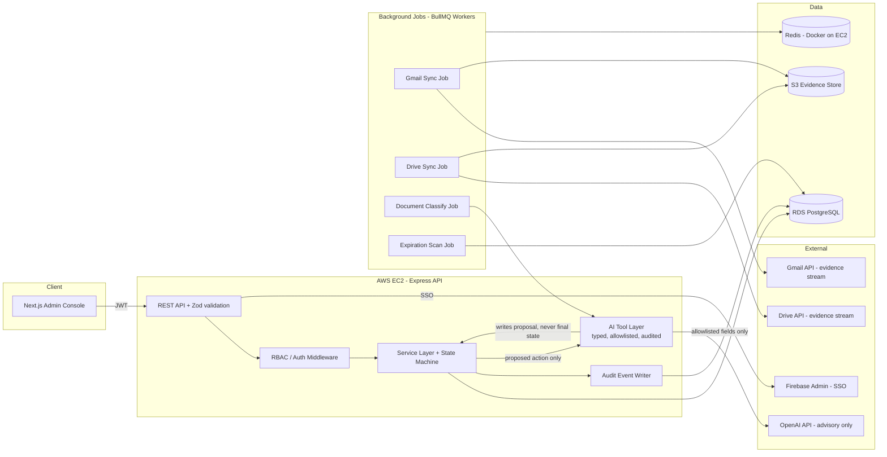
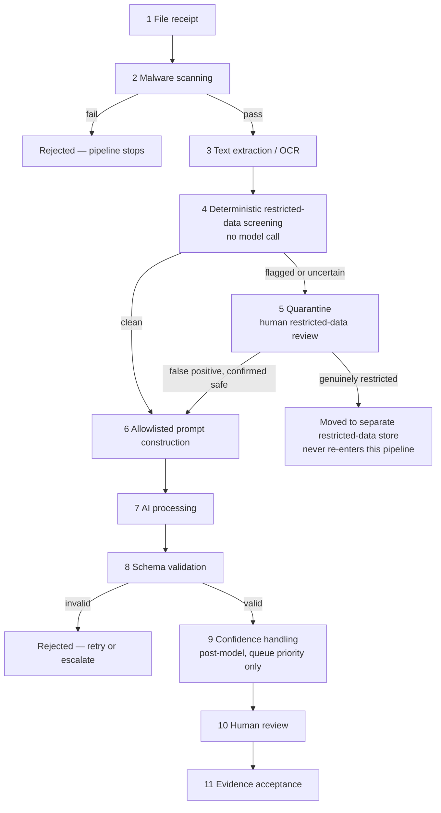

# Keystone AI Provider Onboarding & Readiness — Phase 0 Response

**Prepared by:** Arshad Ali Lagari
**In response to:** Keystone AI Provider Onboarding & Readiness, Consolidated Developer Execution Packet v3.0 (Effective Date 2026-08-24)
**Purpose:** This is a discovery and planning response only, as instructed. It is **not** a commitment to build the full platform and does **not** authorize Phase 1 or later. It proposes architecture, a Phase 0 + Katherine bottom-up estimate, and records every open question rather than resolving it silently, per the packet's own controlling rule (Packet p.1, "Precedence").

---

## 0. How to read this document

Following the packet's own vocabulary (Packet p.1) so terminology stays consistent with the client's controlling document:

- **MUST/MUST NOT** — acceptance requirement
- **SHOULD** — expected unless a written deviation exists
- **MAY** — optional
- **TBD** — a named decision is required before dependent work can start
- **EXTERNAL UNKNOWN** — needs authoritative evidence from Keystone/ChildLink/Elwyn/county before it can become a production rule
- **ASSUMPTION** — a working assumption we are making now, subject to client confirmation

Every item below is tagged with one of these so the client can scan for what actually blocks work.

---

## 1. Gap, Question, Dependency & Assumptions Register

| ID | Type | Item | Related Spec(s) | Decision Needed From | Impact if Unresolved |
|---|---|---|---|---|---|
| G-01 | TBD (awaiting ratification) | We propose self-managed PostgreSQL (AWS RDS) + a custom Node/Express/Prisma backend instead of Supabase, with native PostgreSQL row-level security (not application checks alone) as a mandatory second enforcement layer. Full comparison and rationale in Section 2.4 (ADR-001) and Section 2.5 (RLS strategy). Not yet approved by Keystone. | Spec 71 (RBAC/SoD) | Keystone product owner | Blocks Phase 0 architecture sign-off until ADR-001 is ratified or an alternative is directed. |
| G-02 | TBD | Full original v3.0 PDF ("one self-contained PDF containing specifications 00-83") vs. the reconstructed packet we received — the packet's own "Reconstruction notice" states this edition was rebuilt after the original workspace artifact became unavailable. Several domain specs (34-67: PROMISe/HCSIS, county/joinder overlays, CPSL clearances, fee schedules) currently carry generic boilerplate rather than PA-EI-specific detail. | All specs 34-67 | Keystone | Estimate for Phase 2+ cannot be trusted until we know whether domain-specific detail exists in the original PDF or must be authored jointly during Phase 0/1. |
| G-03 | EXTERNAL UNKNOWN | ChildLink system: API/integration availability, auth model, data contract, rate limits, sandbox/test environment. | Spec 76 | ChildLink / Keystone contract owner | No integration design or estimate possible; Phase 3+ blocked without this. |
| G-04 | EXTERNAL UNKNOWN | Elwyn system: same as above (API, auth, contract, test env). | Spec 76 | Elwyn / Keystone contract owner | Same as G-03. |
| G-05 | EXTERNAL UNKNOWN | County and joinder-specific overlay rules (which counties, what local variations, who ratifies them). | Spec 36, 64 | Keystone / county programs | Phase 2 "nine-provider generalization" cannot be scoped without knowing how many distinct overlays exist. |
| G-06 | EXTERNAL UNKNOWN | PROMISe enrollment, ITF Waiver, and HCSIS workflow specifics — is this read-only lookup, manual reconciliation, or an API integration? | Spec 35 | Keystone / PA DHS program contacts | Directly affects whether Phase 2/3 needs a new integration or a manual evidence-upload workflow. |
| G-07 | TBD | Google Workspace admin access: will Keystone provide a Google Workspace domain with domain-wide delegation for Gmail API + Drive API scoped service access, or do we integrate via individual OAuth per operator? | Spec 08, 09 | Keystone IT/security | Changes both architecture (service account vs. per-user OAuth) and the RBAC/audit model. |
| G-08 | ASSUMPTION | "Katherine" is one fully synthetic provider record (no real PHI/PII) used as the deterministic acceptance fixture per Spec 04/24/82. We assume Keystone will supply or approve the synthetic data content; we do not want to author clinical/legal fixture content unilaterally. | Spec 04, 24, 82 | Keystone Product/Operations | Katherine fixture cannot be finalized without an agreed source for its contents. |
| G-09 | TBD | Authoritative source for PA EI policy citations (Spec 63) — is there an existing internal register, or do we build the Policy Decision and Ratification Register (Spec 43) from zero in Phase 0? | Spec 43, 63 | Keystone Product/Operations | Affects Phase 0 scope/estimate materially. |
| G-10 | ASSUMPTION | No production data or real PHI will be provided during Phase 0/1 (confirmed in job posting). We will build and test exclusively against synthetic fixtures until an explicit, signed authorization changes this. | Spec 03, 10 | — | None if this assumption holds; flags a scope change if it doesn't. |
| G-11 | TBD | Hosting/account ownership: packet requires developer to "work inside accounts/repositories owned by the client." Please confirm Keystone will provision the AWS account, GitHub org, and Google Workspace project so IAM/least-privilege can be set up correctly from day one rather than migrated later. | Spec 14, 71 | Keystone IT | Late account handoff typically forces a costly access-migration pass before go-live. |
| G-12 | TBD | Definition of "operator" headcount and expected concurrent usage (for RDS sizing, Redis sizing, rate-limit tuning, cost estimate). | Spec 25 (NFR) | Keystone Operations | The Tier 2/Tier 3 cost estimates (Section 10.2, 10.3) carry wide ranges specifically because of this open item. |
| G-13 | ASSUMPTION | Non-production and production should run in separate AWS accounts (or, at minimum, separate VPCs with distinct IAM boundaries) rather than one shared account. This is our recommendation, not yet confirmed. | Spec 14, 25 | Keystone IT/security | If a single shared account is mandated instead, the isolation/IAM design in Section 9 and the hardening checklist (Phase 5) change. |
| G-14 | TBD (proposal made, awaiting ratification) | Requester/reviewer/releaser separation (Spec 71): we propose a hard block (same person cannot confirm evidence and release the same practitioner's readiness) with a logged compensating co-sign for small-team deadlock cases — full detail in Section 7.3. Not yet ratified by Keystone. | Spec 71 | Keystone Operations | If Keystone prefers a soft-warning-only approach instead, Section 7.3's service-layer enforcement changes from a hard block to a flagged control. |
| G-15 | ASSUMPTION | Redis runs as a Docker container on the same EC2 instance as the API/workers, to control cost during Phase 0/1. No managed high-availability/failover on Redis until volume justifies a dedicated instance. | Spec 25 (NFR) | Keystone Operations | If Redis availability is a Phase 0/1 concern (e.g., session loss on instance restart is unacceptable), the Section 10 cost estimate increases to add a dedicated, highly-available Redis instance. |

---

## 2. Proposed Technical Architecture & Stack

### 2.1 Principle carried through from the packet

The system stays **deterministic beneath the AI layer** (Packet "Controlling boundary", Spec 00, 03, 05, 69). Concretely: every consequential state change happens through a typed service-layer function backed by a DB constraint and an audit event — never directly from an LLM response. AI output lands in a `proposed_action` / `agent_finding` table that a human reviews before any state transition executes.

### 2.2 Stack (per user's directive — supersedes the job posting's Supabase mention; logged as G-01)

**Backend**
- Node.js 24 (Active LTS) / TypeScript
- Express.js v5
- Prisma ORM v7 + PostgreSQL adapter
- AWS RDS for PostgreSQL

**Runtime baseline and dependency-upgrade policy**
- **Exact supported baseline:** Node.js 24, currently in Active LTS (Active LTS: 2025-10-28 to 2026-10-20; Maintenance: 2026-10-20 to end-of-life 2028-04-30). Compatible with Express v5, Prisma v7, and Next.js 16 on the frontend — no known version conflicts across the stack.
- **Upgrade policy:** we track the Node.js LTS schedule directly (not a fixed version pinned indefinitely). Production stays on the current Active LTS line; we do not run on a line past its Maintenance start without an explicit, agreed exception. When a new even-numbered release enters Active LTS (each October), we schedule the upgrade for the following staging cycle rather than immediately — giving the ecosystem (Prisma, Express, AWS SDK, etc.) time to publish compatible releases first. Security patch releases within the current major version are applied on a monthly review cadence, or sooner for a published critical CVE. Every dependency upgrade runs through the same CI test suite (Section 9) before promotion to staging or production — no version bump ships without passing the automated regression suite.
**Auth & Security — one coherent identity/session model (client point 14)**
- **SSO-only, no local passwords.** Every operator authenticates via Firebase Admin SDK against Keystone's Google Workspace — there is no `bcryptjs`/local-password path in V1. This is a deliberate simplification: the earlier draft listed Firebase, JWT, Google sign-in, *and* local password hashing side by side without saying how they relate, which is exactly what Keystone flagged. Removing the local-password path removes the ambiguity rather than explaining it away.
- **Provisioning:** an operator account is created only by an existing System Administrator, tied to a Keystone Workspace email — there is no self-service sign-up.
- **MFA:** enforced at the Google Workspace level (Keystone's existing org-wide policy applies) rather than a second app-specific MFA system — one less credential surface to secure.
- **Session/token model:** on successful SSO, we issue a short-lived JWT access token (15 min) plus a refresh token. The refresh token's raw value is never stored — only its bcrypt hash (`RefreshToken.tokenHash`), matching the pattern already validated in the developer's production schema library. `Session` rows track device/IP/last-used metadata only; they do not duplicate the token itself, avoiding the two-sources-of-truth issue identified when reviewing that reference schema.
- **Revocation:** disabling a `USER_ACCOUNT` (`is_active = false`) immediately revokes all of that user's `RefreshToken` rows and active `Session` rows in the same transaction — no waiting for tokens to expire. A role change (`USER_ROLE_ASSIGNMENT` insert/delete) does the same, so a permission downgrade takes effect immediately rather than waiting out the access token's 15-minute window.
- **Session duration:** access token 15 minutes; refresh token 12 hours of inactivity or 30 days absolute, whichever is sooner; both configurable per environment.
- **Reauthentication for consequential actions:** approving a `RELEASE_READINESS` transition, authorizing a `SUSPENSION`, or overriding an `OPERATIONAL_RESTRICTION` requires a fresh step-up confirmation even within an active session — implemented via the same `OtpVerification`-style hashed, expiring, attempt-limited code pattern used elsewhere, not a reused password. This is what makes the "affirmative human confirmation" from client point 10 actually hard to click through by accident.
- Helmet, express-rate-limit, CORS allowlist, Zod for all input validation (including AI tool-call arguments — see Section 6)

**Real-time & Background Jobs — safe under multiple running instances (client point 16)**
- Redis (Docker container on the API/worker EC2 instance for Katherine/pilot; a dedicated managed instance is the Section 10 production-tier assumption) — sessions, BullMQ backing store
- BullMQ for **all** scheduled and event-driven background work — Gmail/Drive polling, document classification, expiration scans, follow-up draft generation. We are not using `node-cron`/`node-schedule`: those run in-process and double-fire if more than one API/worker instance is ever running (a real risk the moment we scale past one EC2 instance). BullMQ's repeatable jobs are Redis-backed, so only one worker picks up a given scheduled run regardless of how many instances are online.
- **Idempotency:** every job carries a deterministic dedupe key (e.g., `gmail-sync:{threadId}:{historyId}`); a job that runs twice (retry, redeploy, overlap) is a no-op the second time, checked before any write.
- **Concurrency control:** BullMQ concurrency limits are set per queue (e.g., Gmail sync capped independent of classification jobs) so one slow job type can't starve another.
- **Retry limits:** exponential backoff, capped attempts (default 5) per job type; a job is never retried indefinitely.
- **Dead-letter handling:** a job that exhausts its retries moves to a dead-letter queue rather than silently disappearing — visible in the operator console's quarantine/failure queue (Section 9), not just a log line.
- **Replay:** dead-lettered jobs can be manually re-queued from the console after the underlying cause is fixed (e.g., a Gmail token was expired and has since been refreshed).
- **Reconciliation:** a separate, lower-frequency job compares "messages/files we expected to have processed" against "messages/files we actually have records for" (via Gmail/Drive history tokens and S3 object listings) and raises a `FINDING` if anything was silently missed — this is what catches a dropped job that even dead-lettering didn't catch (e.g., the queue itself was unavailable for a window).
- Socket.io is **deferred past Katherine** — see the scope-trim note below (client point 15). Katherine's UI uses polling/refresh instead of a live socket connection.

**Storage & Media**
- AWS S3 — canonical document store (originals + normalized copies), versioned bucket
- Sharp — thumbnail/preview generation for document review UI
- Multer — upload handling (admin-side manual uploads only; Drive/Gmail evidence comes via API, not upload)

**Communication**
- SendGrid — **deferred past Katherine** (see scope-trim note below); Katherine's `draft_followup_email` tool produces a draft that a human sends manually via Gmail, so no automated outbound-email service is required yet
- Twilio — **removed from the Phase 0/1 stack entirely.** We found no confirmed V1 requirement for SMS in the packet or job posting; re-add only if Keystone confirms a specific use case (register item added below)

**AI**
- OpenAI API, function calling + structured outputs (JSON Schema-validated), per Spec 05 and Spec 22

**Docs, Test, Observability**
- Swagger/OpenAPI for the internal API
- Jest for unit/integration tests
- Winston (structured JSON logs) + Morgan (HTTP access logs)
- CloudWatch (AWS-native) for infra metrics/alarms; application error tracking via Winston → CloudWatch Logs (Sentry is an option, costed separately in Section 10 as optional)

**Repository layout**

```
keystone-ei-backend/
├── src/
│   ├── controller/       # request handlers, thin — delegate to services
│   ├── services/         # business logic, state-machine, audit writes
│   ├── routes/           # API endpoints
│   ├── middleware/       # auth, RBAC guard, validation, audit hook
│   ├── ai/               # tool definitions, schema contracts, prompt assembly, allowlist filter
│   ├── socket/           # websocket handlers (queue/dashboard live updates)
│   ├── jobs/             # BullMQ workers: gmail-sync, drive-sync, classify, expire-scan, digest
│   ├── config/
│   └── utils/
├── packages/
│   ├── libs/              # prisma client singleton, redis client singleton
│   ├── utils/
│   └── error-handler/
├── prisma/                # schema.prisma, migrations, seed (synthetic fixtures incl. Katherine)
└── logs/
```

**Deployment**
- AWS: EC2 for the API + workers, RDS PostgreSQL, Redis (Docker container on the same instance), S3, nginx as reverse proxy/ingress in front of the EC2 instance (TLS termination, security headers) — see the scope-trim note below for what's deferred
- Docker + Docker Compose for local dev; multi-stage builds for production images
- GitHub Actions CI/CD: lint (ESLint/Prettier) → test (Jest) → build → deploy; Husky pre-commit hooks; `npm audit`/Snyk in CI
- **Three environments minimum**: `dev`, `staging` (synthetic-data acceptance testing, incl. Katherine + nine-provider fixtures), `production` — see Spec 25, Spec 14. Production and non-production AWS accounts/VPCs should be separated (ASSUMPTION G-13, see register).

**Frontend**
- Next.js 16 (App Router), TypeScript, Tailwind CSS, shadcn/ui, Redux Toolkit, React Query. For Katherine, served as a Node process on the **same EC2 instance** as the API, behind the same nginx — see scope-trim note below for why a separate Vercel deployment is deferred.

### 2.2a Scope trimmed for Katherine (client point 15)

Client instruction: retain a component only where an accepted Phase 0/Katherine requirement justifies it; simplicity and enforceability are priorities. Reviewed one by one:

| Component | Decision for Katherine | Why |
|---|---|---|
| Socket.io | **Deferred to Phase 4** | Katherine is a single synthetic record; the UI can poll/refresh. Live dashboard updates only earn their cost once there's a real multi-operator queue (Phase 4, Spec 74). |
| Twilio (SMS) | **Removed from Phase 0/1 entirely** | No confirmed V1 requirement in the packet or job posting. Re-add only against a specific, confirmed use case. |
| SendGrid | **Deferred to Phase 3/4** | Katherine's follow-up drafting tool produces a draft; a human sends it via Gmail. No automated outbound email is a V1 requirement yet. |
| CloudFront | **Deferred to Phase 3/4** | No meaningful CDN benefit at Katherine's scale (one record, a handful of documents); S3 presigned URLs are sufficient and simpler to reason about for access control. |
| Redis / BullMQ | **Kept — not premature** | Needed for session storage and to make AI tool calls and the expiration scan idempotent/retryable/dead-letterable (client point 16) even at small scale. This is foundational, not an early optimization. |
| nginx | **Kept** | Standard, cheap TLS-termination/security-header layer in front of a single instance — removing it doesn't simplify anything meaningful. |
| Separate Vercel deployment | **Deferred to Phase 4** | A second hosting account/pipeline/access-control surface for a proof-of-concept UI adds operational surface without a Katherine-specific requirement driving it. Serving Next.js from the same EC2 instance keeps Katherine to one deployment target; revisit Vercel once the Phase 4 operator console has real usage patterns to design for. |

This directly shrinks the **Katherine prototype** cost tier in Section 10 (no CloudFront, no SendGrid, no Twilio, no second hosting account) compared to the Internal Pilot / Production tiers, which restore these as real requirements appear.

### 2.3 High-level component diagram



### 2.4 Architecture Decision Record — ADR-001: Database & Backend Platform

**Status:** Proposed — pending Keystone ratification. Per the client's explicit instruction, this is a recommendation for approval, not an assumed decision; the previously-stated departure from Supabase in this proposal's earlier draft was not yet justified and is superseded by this ADR.

**Context:** The job posting lists Supabase/Supabase Auth/RLS as a preferred technology. The proposed stack instead uses self-managed AWS RDS PostgreSQL with a custom Node/Express/Prisma backend. Keystone has asked for an explicit, criteria-based comparison before approving this departure.

**Options considered**

| Criterion | Option A — Supabase (managed Postgres + Auth + RLS + realtime) | Option B — Self-managed AWS RDS/PostgreSQL + custom Node/Express/Prisma |
|---|---|---|
| **Security (row-level tenant isolation)** | RLS is first-class and automatic: Supabase's client (via PostgREST) injects the authenticated user's JWT into every DB session, so policies referencing `auth.uid()`/`auth.jwt()` are enforced with no extra application code. Strong default. | RLS is available (it is a native PostgreSQL feature, not a Supabase-exclusive one) but nothing wires it up automatically — the application must explicitly set session context (`SET LOCAL app.current_org_id = …`) on every request before each query. Equally strong *if built correctly*, but the correctness depends on our discipline, not the platform's default. |
| **Tenant isolation guarantee** | Enforced at the database layer by default; hard to bypass accidentally from application code. | Requires (a) RLS policies on every tenant-scoped table, (b) a runtime DB role with `BYPASSRLS` explicitly *not* granted, and (c) a dedicated, more-privileged migration role kept separate from the runtime role. If any of these three are missed, isolation silently fails rather than erroring loudly — this must be treated as a release-blocking checklist item, not an assumption. |
| **Operational complexity** | Lower — Supabase manages Postgres upgrades, backups, connection pooling (via PgBouncer/Supavisor), and Auth/session infrastructure. | Higher — we own RDS patching/backup windows, connection pooling (PgBouncer or Prisma's own pool), and all session/token infrastructure ourselves. Materially more moving parts to operate correctly. |
| **Vendor dependency** | Higher — Supabase-specific Auth schema, storage API, and some Postgres extension/config restrictions create switching cost if we ever need to leave. | Lower — RDS PostgreSQL is a commodity managed database; the application layer is ours; portable to any Postgres host with minimal change. |
| **Fit for background-job architecture** | Weak fit for this project's actual workload. Keystone's V1 scope is job-heavy: polling Gmail/Drive, document classification, expiration sweeps, follow-up drafting, idempotent retries (packet Specs 08-10, 29). Supabase has no first-class equivalent to a BullMQ-style durable queue with retry/backoff/dead-letter semantics; achieving this on Supabase would mean bolting on external queue infrastructure (e.g., a separate Redis/queue service) anyway — at that point we are paying for Supabase's Auth/RLS convenience while still building and operating the job infrastructure ourselves. | Strong fit — Express + BullMQ + Redis is built for exactly this kind of durable, retryable, idempotent background processing, which is a core, non-optional requirement of the packet (Spec 29 error/retry/recovery catalog, Spec 08/09 evidence ingestion). |
| **Expected cost (Phase 0/1, low volume)** | ~$25/mo base (Pro plan) plus usage-based overages, **plus** a separate queue/Redis service once job requirements exceed what Edge Functions can reasonably do — likely a similar total to Option B once the missing piece is added. | ~$42-70/mo combined (RDS + EC2 with containerized Redis — see Section 10). Comparable total cost; the difference is where the cost sits (platform fee vs. infrastructure we operate). |
| **Development effort** | Lower upfront (Auth, Admin UI, RLS tooling ship out of the box). | Higher upfront — RLS session-context plumbing, role separation, and job infrastructure must be built by us (estimated ~6-10 hours one-time setup, itemized in Section 3's Phase 0 estimate under RBAC/security scaffolding). |
| **Long-term maintenance** | Tied to Supabase's roadmap, pricing, and platform limits (e.g., Edge Function execution limits, connection limits on lower tiers). | We control upgrade timing, scaling, and configuration directly; more ongoing ownership, but no risk of a third-party platform constraint blocking a future requirement (e.g., a long-running AI batch job). |

**What specifically becomes difficult if we used Supabase alone (without also standing up separate queue/Redis infrastructure):**
- No durable, retryable job queue for Gmail/Drive polling and document classification — Spec 29's idempotent-retry/dead-letter requirements would not be met by Supabase's built-in tooling alone.
- Complex, multi-step AI tool-call orchestration (allowlist filter → OpenAI call → schema validation → human-review queue) is easier to express, unit-test, and audit as typed TypeScript service code than as a mix of SQL functions/triggers and Edge Functions.
- Socket.io-based live queue/dashboard updates (missing-evidence, conflicts, expiring-item queues) would need a different real-time mechanism (Supabase Realtime, which is a different model — Postgres change-data-capture — not a drop-in replacement for our queue-progress events).
- The moment we add a separate Redis/queue service to cover the gap above, we are running two platforms instead of one, which removes most of Supabase's "operational simplicity" advantage while keeping its vendor-dependency cost.

**Recommendation:** Option B (self-managed RDS + custom stack), **with native PostgreSQL RLS implemented as a mandatory second enforcement layer**, not an optional one — see Section 2.5. This is put forward for Keystone's approval, not assumed.

### 2.5 Database-Level Authorization Strategy (Row-Level Security)

Per Keystone's explicit point: **application-layer checks and ordinary database constraints are not automatically equivalent to PostgreSQL row-level security**, and we agree — this section specifies how RLS itself will be implemented, not just app-layer authorization.

**Two independent enforcement layers, both mandatory (defense-in-depth, neither is a substitute for the other):**

1. **Application-layer RBAC** (Section 7) — service-layer functions check role/permission before executing any business action. This is where business rules like "only Compliance Officer can release a readiness state" live, because that logic is not expressible as a simple row filter.
2. **Database-layer RLS** — every tenant/resource-scoped table has `ENABLE ROW LEVEL SECURITY` and explicit `CREATE POLICY` statements. This is a backstop: even if an application-layer bug or a future direct-DB-access script omits a check, the database itself refuses to return or modify rows outside the caller's authorized scope.

**Isolation dimensions enforced by RLS policies:**

| Dimension | Enforced via | Example |
|---|---|---|
| Organization | `organization_id` column + session variable `app.current_org_id` | A coordinator at Org A cannot read Org B's provider records, even via a raw query. |
| Location | `location_id` column, checked against the caller's assigned location scope (for roles scoped below the org level) | TBD whether V1 needs location-level scoping in addition to org-level — flagged for the data-model revision (client point 7) rather than assumed here. |
| Practitioner | `practitioner_id` linkage through the affiliation, requirement, and evidence tables (Section 4) | A record's evidence rows inherit the organization scope of whichever `PRACT_ORG_AFFILIATION` is active at the time. |
| User | `current_setting('app.current_user_id')`, used for self-scoped views (e.g., "my assigned queue items") | |
| Role | Policies reference a role-lookup, not a hardcoded role name, so role definitions can change without rewriting policies | |
| Data class (restricted vs. standard) | A separate `data_class` column/policy on any table capable of holding evidence metadata; restricted-class rows are only readable by roles explicitly granted restricted-data access, independent of org membership | Directly implements Spec 03/10's routing requirement at the storage layer, not just at the AI-input-filter layer. |

**How session context reaches PostgreSQL (the part Supabase gives for free and we must build):**

- A Prisma middleware/extension wraps every database-touching request in a transaction that issues `SET LOCAL app.current_org_id`, `app.current_user_id`, and `app.current_role` before the actual query — sourced from the verified JWT, never from client-supplied request parameters.
- Background jobs (BullMQ workers) run under a distinct, narrowly-scoped **system role** with its own RLS policies (e.g., allowed to write classification proposals, not allowed to write final decisions) — workers do not run as an unrestricted service account.
- **Role separation is a hard requirement, not a convention:** the runtime application database role has `BYPASSRLS` explicitly revoked; only a separate migration role (used solely by CI/CD for schema changes, never by the running application) has elevated privileges. This is the single most common way RLS silently fails to apply, so it is called out as its own acceptance check below.

**Negative testing (directly answering "how will this be enforced and negatively tested"):**

- A dedicated test suite connects to the database **as the application's runtime role**, bypassing the Express layer entirely, and asserts that cross-organization reads/writes are rejected — this proves RLS itself, independent of whether the application code remembers to filter.
- A CI check fails the build if any table under `prisma/schema.prisma` that should be tenant-scoped does not have `ENABLE ROW LEVEL SECURITY` set (schema-linter script, part of Phase 0 deliverables).
- A CI check fails the build if the runtime role has `BYPASSRLS` or superuser privileges (queries `pg_roles` in the test database as part of the acceptance suite).
- Katherine's acceptance test (Section 8) includes at least one negative scenario: an authenticated user from a different synthetic organization attempting to read Katherine's record, asserted to return zero rows.

**If Supabase were used instead**, the same policies and the same negative-testing approach would still be required — RLS correctness is not free even on Supabase, since a misconfigured policy is still a misconfigured policy. What Supabase removes is only the *session-context plumbing* (item 1 above), because PostgREST does that automatically from the JWT; it does not remove the need to design and negatively test the policies themselves.

---

## 3. Bottom-Up Estimate — Phase 0 + Katherine Milestone

Per Spec 83's rule, hours are broken out by category rather than a single lump figure. Per client point 18, every line also carries a **deliverable tier** — Design/Specification, Prototype, or Production-intent — so it's clear what Keystone actually receives at each line, and nothing prototype-level is presented as a completed production requirement. **Production Hardening (the fourth tier client point 18 names) does not appear below — it is out of scope for Phase 0/Katherine entirely and belongs to Phase 5** (packet's own phase structure); nothing in this milestone is hardening work. These are **planning estimates**, not a fixed bid, and assume the open items in Section 1 resolve within Phase 0.

### Phase 0 — Foundation control (Specs 00-03, 20-23, 43, 50, 63, 68-72, 78)

| Category | Tier | Hours | What Keystone receives |
|---|---|---|---|
| Repo/env/CI scaffold | Production-intent | 6-8 | Monorepo, Docker Compose, GitHub Actions, three environments — carries forward unchanged into every later phase |
| Canonical data model — Prisma schema, 27+ entities, migrations (Section 4) | Production-intent | 14-18 | The actual schema this proposal specifies, not a placeholder — includes the multi-org/multi-location/effective-dated structure from client point 7 |
| RLS policy implementation + role separation + negative-test suite (Section 2.5) | Production-intent | 8-10 | Working RLS policies on every tenant-scoped table, plus the negative tests that prove it (client point 6) |
| RBAC scaffolding — 6 roles, 8 permission dimensions (Section 7) | Production-intent | 8-10 | Middleware + service-layer checks enforcing the revised matrix (client point 13), not just documentation of it |
| Identity/session design implementation — SSO, token/session model, step-up reauth (Section 2.2) | Production-intent | 6-8 | The coherent auth model from client point 14, working end-to-end |
| State-machine contract — guards, transition tables (Section 5) | Production-intent | 6-8 | The six-concept model (client point 9) implemented as guarded transitions, not just the table in this document |
| Restricted-data pipeline, steps 1-6 (Section 11.1: receipt through prompt construction) | Production-intent | 5-6 | Steps 7-11 land under Katherine below, once there's a document to run them against |
| Deployment — AWS provisioning (Section 10.1 spec: RDS `db.t4g.medium`, EC2 `t3.medium`, S3, Redis-on-EC2, nginx/TLS), CI/CD pipeline | Production-intent | 10-14 | A real, reachable environment — not local-only |
| Documentation — architecture doc, ADR-001, this proposal, the register | Design/Specification | 6-8 | The written deliverables Keystone asked for in the job posting |
| QA — test harness setup, schema-lint CI check | Production-intent | 3-4 | Automated check that blocks a merge if RLS is missing from a tenant-scoped table |
| Contingency (~12%) | — | 9-11 | |
| **Phase 0 subtotal** | | **81-105h** | |

### Katherine proof milestone (Specs 04-05, 07, 22-24, 33, 42, 73, 82)

| Category | Tier | Hours | What Keystone receives |
|---|---|---|---|
| Katherine fixture loader + seed | Prototype (rebuilt if content changes, per G-08) | 4-5 | The immutable, versioned fixture (Section 8) |
| Requirement/evidence/status engine — full per-dimension recalculation (Section 5.2) | Production-intent | 16-20 | End-to-end: intake → checklist → evidence → Detection/Recalculation/Restriction/Human-review/Release, all six concepts from client point 9 working, not simulated |
| AI agent tool contracts — classify/extract/draft/summarize (Section 6) | Production-intent | 10-13 | Four typed, schema-validated, audited tools; `flag_missing_requirement` is deterministic code, not a tool (Section 6.4) |
| Restricted-data pipeline, steps 7-11 (AI processing through evidence acceptance, Section 11.1) | Production-intent | 6-8 | The confirmation-gated evidence-acceptance flow from client point 10 |
| Requester/reviewer/releaser enforcement + compensating co-sign (Section 7.3) | Production-intent | 4-5 | The hard-block-plus-co-sign mechanism proposed to resolve G-14 |
| BullMQ job infrastructure — idempotency, concurrency limits, retry, dead-letter, replay, reconciliation (Section 2.2, client point 16) | Production-intent | 8-10 | Safe under multiple running instances from day one, not retrofitted later |
| Audit log implementation | Production-intent | 4-5 | Queryable `AUDIT_EVENT` rows, not just log files |
| Frontend — login, practitioner detail, checklist, evidence view + confirmation UI, ten-dimension readiness dashboard, release/reinstatement decision screen (with step-up reauth), audit log timeline, quarantine review queue (~8 screens); shadcn/Tailwind components, no Figma pass (Section 2.2a, client query answered) | Prototype UI over production-intent API contracts | 30-38 | A working demo of the job posting's own "Login → provider record → checklist → status engine → audit log" vertical slice — visual polish is explicitly deferred to Phase 4's UX pass (Spec 11) |
| QA — automated regression fixture, incl. negative RLS/cross-org scenario (Spec 24, 73) | Production-intent | 8-10 | Deterministic re-run producing semantically equivalent output, every time |
| External dependency — OpenAI integration + prompt/schema iteration | Production-intent | 5-7 | |
| Documentation — Katherine plan, demonstration script | Design/Specification | 3-4 | |
| Contingency (~12%) | — | 12-15 | |
| **Katherine subtotal** | | **110-140h** | |

**Combined Phase 0 + Katherine range: ~191-245 hours.** We recommend billing Phase 0 and Katherine as two separately authorized sub-milestones (matches Spec 20/83's per-milestone gate rule, and client point 19) rather than one lump sum, so the client can stop after Phase 0 if desired. Point 19's full milestone breakdown (deliverables/exclusions/dependencies/tests/acceptance/payment-gate/go-no-go per milestone) is addressed separately once we get to that item.

---

## 4. Proposed Canonical Data Model

**Revision note:** the previous version of this section collapsed several distinct real-world relationships into single foreign keys (one organization per practitioner, one location, one global readiness status). Keystone correctly flagged this as insufficient. This revision replaces every one-to-one assumption with the many-to-many, effective-dated, and multi-dimensional structure the PA EI domain actually requires. It reuses two patterns validated in the developer's own production schema library: (1) auth/actor identity kept separate from business-entity tables, with soft-delete and an immutable, generic audit-event shape; (2) narrow join tables carrying their own lifecycle fields rather than bare many-to-many pivots — both carried forward here and extended with the effective-dating this domain needs.

### 4.1 Design rules this model follows

1. **No relationship is assumed to be one-to-one** unless the domain guarantees it (e.g., one `Decision` has exactly one deciding user). Every organization/location/specialty/county link is a join table, not a foreign key on the practitioner.
2. **Every relationship that can change over time carries `effective_from` / `effective_to`.** History is queried, never overwritten.
3. **Evidence and requirement rules are versioned, never edited in place.** A new version supersedes the old one via a self-referencing `supersedes_*_id`; nothing is deleted.
4. **Readiness is ten separate, independently-tracked dimensions, not one field.** A single `ReadinessSummaryView` rolls them up for operator display only — it is a read model, not a source of truth, and nothing writes to it directly.
5. **Cascade-delete is used only for records that should genuinely disappear with their owner** (e.g., a revoked user-role assignment). Business/compliance records (evidence, findings, decisions, audit events) are never hard-deleted — matches the packet's own "deletion never destroys audit history" rule (Spec 09) and is why `AuditEvent.actor_user_id` uses `ON DELETE SET NULL`, never `CASCADE`.
6. **Every tenant-scoped table carries `organization_id` (directly or via its parent)** so the RLS policies proposed in Section 2.5 have a consistent column to key off.
7. **No AI-derived classification satisfies a release prerequisite by itself, regardless of confidence.** `EVIDENCE_RECORD.confirmed_by_user_id` must be non-null before that evidence counts toward any requirement — there is no confidence threshold in V1 that skips this. See Section 6.2.

**Terminology note:** the packet generally says "provider" for the individual person being onboarded. This model names that entity `PRACTITIONER` instead, to keep it unambiguous from `ORGANIZATION` (the agency) now that a practitioner can be affiliated with multiple organizations — the packet itself sometimes uses "provider" loosely for either the person or the agency. We'd like to confirm this mapping (`PRACTITIONER` = packet's "provider") is acceptable, or adopt Keystone's preferred term, as part of the canonical terminology work in Spec 79.

### 4.2 Entity-relationship diagram

```mermaid
erDiagram
    %% --- Identity & access (internal operators only; practitioners are not system users in V1) ---
    USER_ACCOUNT ||--o{ USER_ROLE_ASSIGNMENT : has
    ROLE ||--o{ USER_ROLE_ASSIGNMENT : "granted via"

    %% --- Organizational structure ---
    ORGANIZATION ||--o{ LOCATION : has
    LOCATION }o--|| COUNTY : "located in"
    ORGANIZATION ||--o{ ORG_COUNTY_PARTICIPATION : participates
    COUNTY ||--o{ ORG_COUNTY_PARTICIPATION : hosts
    JOINDER ||--o{ ORG_COUNTY_PARTICIPATION : via

    %% --- Practitioner relationships (all many-to-many, all effective-dated) ---
    PRACTITIONER ||--o{ PRACT_ORG_AFFILIATION : "affiliated via"
    ORGANIZATION ||--o{ PRACT_ORG_AFFILIATION : affiliates
    PRACTITIONER ||--o{ PRACT_LOCATION_ASSIGNMENT : "assigned via"
    LOCATION ||--o{ PRACT_LOCATION_ASSIGNMENT : hosts
    PRACTITIONER ||--o{ SUPERVISION_RELATIONSHIP : "supervisor in"
    PRACTITIONER ||--o{ SUPERVISION_RELATIONSHIP : "supervisee in"
    PRACTITIONER ||--o{ PRACT_SPECIALTY : holds
    SPECIALTY ||--o{ PRACT_SPECIALTY : "assigned via"
    DISCIPLINE ||--o{ PRACT_SPECIALTY : scopes
    DISCIPLINE ||--o{ REQUIREMENT_DEFINITION : "applies to"

    %% --- Requirements, evidence, exceptions (versioned, many-to-many) ---
    REQUIREMENT_DEFINITION ||--o{ REQUIREMENT_DEFINITION : supersedes
    REQUIREMENT_DEFINITION ||--o{ REQUIREMENT_APPLICABILITY : "applies via"
    PRACTITIONER ||--o{ REQUIREMENT_APPLICABILITY : requires
    REQUIREMENT_APPLICABILITY ||--o{ WAIVER : "may be waived by"
    REQUIREMENT_APPLICABILITY ||--o{ EVIDENCE_REQ_LINK : "satisfied via"
    EVIDENCE_RECORD ||--o{ EVIDENCE_REQ_LINK : "applies to"
    EVIDENCE_RECORD ||--o{ EVIDENCE_RECORD : supersedes
    EVIDENCE_RECORD ||--o{ EVIDENCE_SOURCE_REF : "sourced from"

    %% --- Findings, decisions, AI proposals ---
    PRACTITIONER ||--o{ FINDING : has
    FINDING ||--o{ DECISION : "resolved by"
    USER_ACCOUNT ||--o{ DECISION : makes
    AI_TOOL_CALL_LOG ||--o{ FINDING : proposes
    PRACTITIONER ||--o{ AI_TOOL_CALL_LOG : "subject of"

    %% --- Restriction, suspension, reinstatement (client point 9 — distinct from detection/recalculation/release) ---
    RESTRICTION_POLICY ||--o{ OPERATIONAL_RESTRICTION : authorizes
    FINDING ||--o{ OPERATIONAL_RESTRICTION : "may trigger"
    PRACTITIONER ||--o{ OPERATIONAL_RESTRICTION : "restricted by"
    PRACTITIONER ||--o{ SUSPENSION : "suspended by"
    DECISION ||--o{ SUSPENSION : authorizes
    DECISION ||--o{ OPERATIONAL_RESTRICTION : "may override"

    %% --- Readiness dimensions: separate tables, never collapsed (client point 8) ---
    PRACTITIONER ||--o| QUALIFICATION_STATUS : has
    PRACTITIONER ||--o| CLEARANCE_STATUS : has
    PRACTITIONER ||--o| TRAINING_STATUS : has
    PRACTITIONER ||--o| ENROLLMENT_STATUS : has
    ORGANIZATION ||--o| CONTRACT_STATUS : has
    ORGANIZATION ||--o| BILLING_CONFIG_STATUS : has
    ORG_COUNTY_PARTICIPATION ||--o| LOCAL_PROGRAM_APPROVAL_STATUS : has
    PRACTITIONER ||--o| CAPACITY_STATUS : has
    PRACTITIONER ||--o| ASSIGNMENT_READINESS_STATUS : has
    PRACTITIONER ||--o| RELEASE_READINESS : has
    DECISION ||--o{ RELEASE_READINESS : gates
    PRACTITIONER ||--o| READINESS_SUMMARY_VIEW : "read model only"

    %% --- Audit (every table above writes here; edge omitted for readability) ---

    USER_ACCOUNT {
        uuid id PK
        string email
        boolean is_active
        timestamptz deleted_at "soft delete only, never hard-deleted"
    }
    USER_ROLE_ASSIGNMENT {
        uuid id PK
        uuid user_id FK
        uuid role_id FK
        string scope_type "GLOBAL | ORGANIZATION | COUNTY | LOCATION"
        uuid scope_id FK "nullable when scope_type=GLOBAL"
    }
    ORGANIZATION {
        uuid id PK
        string legal_name
        string keystone_org_ref
    }
    LOCATION {
        uuid id PK
        uuid organization_id FK
        uuid county_id FK
        string address
    }
    COUNTY {
        uuid id PK
        string name
        string fips_code
    }
    JOINDER {
        uuid id PK
        string name
    }
    ORG_COUNTY_PARTICIPATION {
        uuid id PK
        uuid organization_id FK
        uuid county_id FK
        uuid joinder_id FK "nullable"
        date effective_from
        date effective_to "nullable = current"
    }
    PRACTITIONER {
        uuid id PK
        string display_name
        string note "no organization_id or location_id here — see affiliation/assignment tables"
    }
    PRACT_ORG_AFFILIATION {
        uuid id PK
        uuid practitioner_id FK
        uuid organization_id FK
        string employment_type "EMPLOYEE | CONTRACTOR"
        date effective_from
        date effective_to "nullable = current"
    }
    PRACT_LOCATION_ASSIGNMENT {
        uuid id PK
        uuid practitioner_id FK
        uuid location_id FK
        date effective_from
        date effective_to "nullable = current"
    }
    SUPERVISION_RELATIONSHIP {
        uuid id PK
        uuid supervisor_practitioner_id FK
        uuid supervisee_practitioner_id FK
        uuid discipline_id FK "nullable"
        date effective_from
        date effective_to "nullable = current"
    }
    PRACT_SPECIALTY {
        uuid id PK
        uuid practitioner_id FK
        uuid specialty_id FK
        uuid discipline_id FK
        date effective_from
        date effective_to "nullable = current"
    }
    REQUIREMENT_DEFINITION {
        uuid id PK
        string code
        uuid discipline_id FK
        string source_citation
        string rule_version
        uuid supersedes_requirement_id FK "nullable, self-ref"
    }
    REQUIREMENT_APPLICABILITY {
        uuid id PK
        uuid practitioner_id FK
        uuid requirement_definition_id FK
        string status "applicable | waived | not_applicable"
    }
    WAIVER {
        uuid id PK
        uuid requirement_applicability_id FK
        string reason
        uuid approved_by_user_id FK
        date effective_from
        date expires_on "nullable"
    }
    EVIDENCE_RECORD {
        uuid id PK
        string storage_uri "s3 ref, versioned bucket"
        string data_class "standard | restricted"
        date expires_on "nullable"
        string status "pending | valid | expired | conflicted | quarantined"
        uuid supersedes_evidence_id FK "nullable, self-ref version chain"
        string ai_classification "AI-proposed only — advisory, never authoritative on its own"
        float ai_confidence "informational/triage only — never a gate that skips human confirmation"
        uuid confirmed_by_user_id FK "nullable — NULL means not yet usable toward any release prerequisite, regardless of ai_confidence"
        timestamptz confirmed_at "nullable"
    }
    EVIDENCE_REQ_LINK {
        uuid evidence_record_id FK
        uuid requirement_applicability_id FK
    }
    EVIDENCE_SOURCE_REF {
        uuid id PK
        uuid evidence_record_id FK
        string source_system "gmail | drive | manual_upload"
        string content_hash
    }
    FINDING {
        uuid id PK
        uuid practitioner_id FK
        string finding_type
        string status
        uuid raised_by_ai_tool_call_id FK "nullable"
    }
    DECISION {
        uuid id PK
        uuid finding_id FK "nullable"
        uuid decided_by_user_id FK
        string decision_type "RELEASE | REJECT | WAIVER_APPROVAL | SUSPENSION | REINSTATEMENT | RESTRICTION_OVERRIDE"
        string rationale
    }
    RESTRICTION_POLICY {
        uuid id PK
        string dimension "which of the 10 readiness dimensions this rule governs"
        string requirement_type "nullable, narrows to a specific requirement"
        boolean auto_restrict "true = a non-compliant recalculation restricts automatically; false = routes to Human Review instead"
        string ratified_decision_ref "DEC-xxx, Spec 43 Policy Decision and Ratification Register — required before auto_restrict=true can go live"
    }
    OPERATIONAL_RESTRICTION {
        uuid id PK
        uuid practitioner_id FK
        uuid triggered_by_finding_id FK "nullable"
        uuid authorized_by_policy_id FK "nullable if manually applied by a human Decision instead"
        uuid overridden_by_decision_id FK "nullable"
        string restriction_type "e.g. no_new_assignment, service_hold"
        string status "active | lifted"
        date effective_from
        date effective_to "nullable = ongoing"
    }
    SUSPENSION {
        uuid id PK
        uuid practitioner_id FK
        uuid authorized_by_decision_id FK "never nullable — suspension is always human-decided, Spec 41/62"
        string reason
        date effective_from
        date effective_to "nullable = ongoing, set on reinstatement"
        uuid reinstated_by_decision_id FK "nullable"
    }
    AI_TOOL_CALL_LOG {
        uuid id PK
        string tool_name
        uuid practitioner_id FK
        string input_hash
        string output_hash
        string result_status
    }
    RELEASE_READINESS {
        uuid id PK
        uuid practitioner_id FK
        string status
        uuid decision_id FK "the human gate — only source of RELEASED"
    }
    READINESS_SUMMARY_VIEW {
        uuid practitioner_id PK
        string qualification_display
        string clearance_display
        string training_display
        string enrollment_display
        string capacity_display
        string assignment_display
        string release_display
        string note "computed/cached for operator dashboard only — never written to directly, never used as an authorization source"
    }
```



**Note on the readiness-dimension tables:** `QUALIFICATION_STATUS`, `CLEARANCE_STATUS`, `TRAINING_STATUS`, `ENROLLMENT_STATUS`, `CONTRACT_STATUS`, `BILLING_CONFIG_STATUS`, `LOCAL_PROGRAM_APPROVAL_STATUS`, `CAPACITY_STATUS`, and `ASSIGNMENT_READINESS_STATUS` all follow the same shape (id, owning-entity FK, `status`, `effective_from`, `source_of_truth_ref`) — shown once here rather than nine times for readability:

```
{DIMENSION}_STATUS {
    uuid id PK
    uuid owning_entity_id FK   -- practitioner_id, organization_id, or org_county_participation_id depending on dimension
    string status              -- dimension-specific enum, ratified per Spec 43
    date effective_from
    string source_of_truth_ref -- what computed or authorized this value (rule engine run, external system, or Decision id)
}
```

`RELEASE_READINESS` is the one dimension that is structurally different from the other nine: it can only reach a released status through a `decision_id` pointing at a human-made `DECISION` row — there is no `source_of_truth_ref` path that lets a rule engine or AI tool call set it directly. This is the schema-level enforcement of "human-controlled release, not just a documented rule" (packet Controlling Boundary, Spec 00).

### 4.3 Traceability — how this model addresses each requirement Keystone raised

| Keystone requirement (point 7) | Addressed by |
|---|---|
| Practitioner working through multiple organizations | `PRACT_ORG_AFFILIATION` (many-to-many, not a FK on `PRACTITIONER`) |
| Multiple locations | `PRACT_LOCATION_ASSIGNMENT` (many-to-many) |
| Employment and contractor relationships | `PRACT_ORG_AFFILIATION.employment_type` |
| Supervisor relationships | `SUPERVISION_RELATIONSHIP` (practitioner-to-practitioner, discipline-scoped) |
| Multiple specialties and disciplines | `PRACT_SPECIALTY` (many-to-many, discipline-scoped) |
| County and joinder participation | `ORG_COUNTY_PARTICIPATION` (org × county × joinder, many-to-many) |
| Effective-dated relationships | Every join table above carries `effective_from`/`effective_to` |
| Evidence versions | `EVIDENCE_RECORD.supersedes_evidence_id` self-referencing chain; storage stays on a versioned S3 bucket |
| One evidence item satisfying multiple requirements | `EVIDENCE_REQ_LINK` (many-to-many between `EVIDENCE_RECORD` and `REQUIREMENT_APPLICABILITY`) |
| Separate org/location/practitioner/specialty/enrollment/contract/clearance/training/capacity/assignment/release dimensions | Distinct entities/tables throughout Section 4.2 — no field collapses two of these together |
| Multiple roles and resource scopes per user | `USER_ROLE_ASSIGNMENT` (user × role × scope_type × scope_id, many-to-many) |
| Exceptions, waivers, findings, decisions, policy versions | `WAIVER`, `FINDING`, `DECISION`, `REQUIREMENT_DEFINITION.supersedes_requirement_id` |

This also directly satisfies client point 8 (readiness not reduced to one status): qualification, clearance, training, enrollment, contracting, billing configuration, local-program approval, capacity, assignment readiness, and release authority are ten separate tables (Section 4.2), each independently updatable, rolling up only into a non-authoritative `READINESS_SUMMARY_VIEW` for operator display — matching the packet's own distinction between "Billing Configuration Ready" and enrolled/contracted/assignable/service-ready/claim-payable (Spec 79).

Client point 9 (Detection / Recalculation / Operational restriction / Suspension / Human review / Final release-or-reinstatement kept distinct) is addressed by the `RESTRICTION_POLICY`, `OPERATIONAL_RESTRICTION`, and `SUSPENSION` entities added to Section 4.2, and worked through in full in Section 5.

**Explicit exclusion:** PHI/child-family case fields, banking/tax fields are **not modeled in this schema at all** for V1 — not even as nullable columns — per Spec 03/10. Any future need for them goes through a separate, explicitly-gated restricted-data store, not this schema.

---

## 5. Readiness-State and Transition Model (draft — subject to Spec 33/69 ratification)

**Revision note:** the previous version of this section was one linear chain that quietly mixed together six different concepts — exactly what Keystone flagged. This revision separates them explicitly. Each of the ten readiness dimensions from Section 4 goes through its own instance of the same lifecycle; `RELEASE_READINESS` and `SUSPENSION` additionally sit at the practitioner level, above the individual dimensions.

### 5.1 Six distinct concepts (not one state machine)

| # | Concept | What it actually is | Automatic or human-gated | Scope | Implemented by (Section 4) |
|---|---|---|---|---|---|
| 1 | **Detection** | An observation that something changed — evidence expired, a document was classified, a conflict was found, a duplicate request was flagged | Automatic (deterministic code, or AI-proposed and then reviewed) — always non-consequential by itself | One evidence item / one requirement | New `FINDING` row |
| 2 | **Recalculation of readiness** | A deterministic recompute of **one** dimension's status given current evidence and findings | Automatic and deterministic — **never AI** | One dimension, one practitioner (or organization, for org-level dimensions) | The relevant `{DIMENSION}_STATUS.status` is updated; the update itself is logged as an `AUDIT_EVENT`, not silently overwritten |
| 3 | **Operational restriction** | A practical limitation on what the practitioner may currently do (e.g., "no new assignments") | **Conditional, not automatic by default** — only automatic where a *ratified* policy explicitly says so; otherwise routes to Human Review instead | Practitioner-level, may reference one or more dimensions | New `OPERATIONAL_RESTRICTION` row, referencing the `RESTRICTION_POLICY` rule that authorized it, or a human `DECISION` |
| 4 | **Suspension** | A formal, heavier action halting active service entirely | **Always human-gated** — never triggered automatically by a recalculation or restriction, per Spec 41/62 | Practitioner-level | New `SUSPENSION` row, always tied to an authorizing `DECISION` |
| 5 | **Human review** | Routing a Finding, a Recalculation result, or a prospective restriction into an operator queue before anything consequential happens | This step *is* the human step — nothing here is automatic | Queue-level (Section 9's work queues) | `FINDING.status = escalated`; queue views over open Findings/prospective restrictions |
| 6 | **Final release or reinstatement** | The consequential state change that activates (release) or reactivates (reinstatement) a practitioner | **Always human-gated, never automatic, never AI** | Practitioner-level | `RELEASE_READINESS.decision_id` → a `DECISION` with `decision_type = RELEASE` or `REINSTATEMENT` |

Keystone's own example maps directly onto this table: an expired document triggers **(1) Detection** (a `FINDING`) and **(2) Recalculation** (`CLEARANCE_STATUS` moves to non-compliant) automatically. Whether that **(3) restricts operations** depends on whether a ratified `RESTRICTION_POLICY` row exists for "clearance / expired" with `auto_restrict = true` — if none exists, it routes to **(5) Human review** instead, and a person decides whether to restrict, escalate toward suspension, or simply request updated evidence. Nothing skips straight from Detection to Suspension or Release.

### 5.2 Generic per-dimension lifecycle

Applies independently to each of `QUALIFICATION_STATUS`, `CLEARANCE_STATUS`, `TRAINING_STATUS`, `ENROLLMENT_STATUS`, `CONTRACT_STATUS`, `BILLING_CONFIG_STATUS`, `LOCAL_PROGRAM_APPROVAL_STATUS`, `CAPACITY_STATUS`, and `ASSIGNMENT_READINESS_STATUS`:

| From | Event | To | Guard | Human Gate? |
|---|---|---|---|---|
| `compliant` | Evidence expires / conflict found / external flag received | `compliant` (unchanged) + new `FINDING` | — | No (Detection only, no state change yet) |
| any | `FINDING` exists for this dimension | Dimension `status` recalculated (`at_risk` / `non_compliant` / back to `compliant`) | Deterministic rule engine only | No (Recalculation) |
| `non_compliant` | Recalculation completes | `restricted` | A `RESTRICTION_POLICY` row for this dimension has `auto_restrict = true` | No — but only because a human already ratified the policy in advance |
| `non_compliant` | Recalculation completes | routed to Human Review queue | No matching `auto_restrict = true` policy | This step **is** the human step |
| Human Review | Operator decides | `restricted` (manual) / `compliant` (finding dismissed) / escalated toward Suspension consideration | `DECISION` recorded | **Yes** |
| `restricted` | New evidence resolves the underlying finding | `compliant` | Recalculation confirms compliance | No (automatic lift, still logged) |

`RELEASE_READINESS` and `SUSPENSION` do **not** follow this generic table — they are practitioner-level and always human-gated, shown separately below.

### 5.3 Release / Reinstatement lifecycle (practitioner-level, always human-gated)

| From State | Event / Trigger | To State | Guard(s) | Human Gate? |
|---|---|---|---|---|
| `not_ready` | All ten dimensions show `compliant`/acceptable | `ready_for_human_review` | No open Findings, no active `OPERATIONAL_RESTRICTION` | No (this is a routing step, not a release) |
| `ready_for_human_review` | Reviewer approves | `released` | Authorized role (Compliance Officer/Owner); `DECISION.decision_type = RELEASE`; immutable audit event written | **Yes — AI cannot trigger this** |
| `ready_for_human_review` | Reviewer rejects / requests more evidence | `not_ready` | `DECISION` + reason code | **Yes** |
| `released` | Any dimension recalculates to `restricted` or `non_compliant` | `released` (unchanged) + `OPERATIONAL_RESTRICTION` logged | Recalculation only affects the dimension, not `RELEASE_READINESS` directly | No — release status itself doesn't silently flip; a human decides whether it should |
| `released` | Suspension decision made | `suspended` | `SUSPENSION` row + authorizing `DECISION`; per Spec 41/62 | **Yes** |
| `suspended` | Reinstatement decision made | `released` | `DECISION.decision_type = REINSTATEMENT`; `SUSPENSION.reinstated_by_decision_id` set | **Yes** |
| any state | Restricted-data or classification uncertainty detected | unchanged + `quarantine` flag on the evidence itself | Deterministic classifier flags (Section 2.5/6) | No (quarantine is a safety default on the *evidence*, not a practitioner-level penalty) |

Invalid transitions **MUST** return a stable reason code and create no partial state (Spec 69). All three tables in this section are **drafts for discussion**, not ratified — final versions depend on Spec 33 (PA EI Readiness State Model) content, which we don't yet have in domain-specific form (see G-02), and on Keystone ratifying the actual `RESTRICTION_POLICY` rows (which dimensions/requirement types auto-restrict vs. route to Human Review is a business decision, not something we can assume).

---

## 6. Proposed API, AI-Agent Tool, and Structured-Response Contracts

### 6.1 REST API surface (Phase 0/1 slice only)

```
POST   /auth/login                      (Firebase SSO exchange -> JWT)
POST   /auth/refresh
GET    /providers/:id
POST   /providers
GET    /providers/:id/requirements
GET    /providers/:id/evidence
POST   /providers/:id/evidence           (manual upload only; API-sourced evidence is job-driven)
GET    /providers/:id/findings
POST   /decisions                        (human-only; requires role check)
GET    /providers/:id/audit
GET    /queues/:queueName                (missing-evidence, conflicts, expiring, quarantine, review)
```

### 6.2 AI agent tool contract example

Every tool: (1) takes only allowlisted fields as input, (2) returns a JSON-Schema-validated structured response, (3) writes an `AI_TOOL_CALL_LOG` row, (4) never itself calls a state-mutating service — it returns a *proposal* that a human or a deterministic rule engine acts on.

```jsonc
// Tool: classify_document
// Input (allowlisted fields only — no PHI, no financial fields)
{
  "practitioner_id": "uuid",
  "document_storage_uri": "s3://...",
  "extracted_text_excerpt": "string, denylist-filtered before this point"
}

// Output schema (OpenAI structured output / function calling)
{
  "type": "object",
  "required": ["document_type", "confidence", "expires_on", "reason"],
  "properties": {
    "document_type": { "type": "string", "enum": ["license", "certification", "background_check", "insurance", "training_record", "other"] },
    "confidence": { "type": "number", "minimum": 0, "maximum": 1 },
    "expires_on": { "type": ["string", "null"], "format": "date" },
    "reason": { "type": "string" }
  }
}
```

This tool is only ever called on text that has already passed the **deterministic, pre-model restricted-data screening** in Section 11.1 (steps 1-6) — `confidence` in the output above is a **post-model** field and plays no role in that earlier screening decision. If the classifier flags a denylisted content signature at step 4, the pipeline routes to quarantine (step 5) and this tool is never invoked at all — that check happens in `src/ai/allowlist-filter` against plain extracted text, with no model call involved. The two mechanisms run at different pipeline stages and are never combined into one condition; see Section 11.1 for the full ordered pipeline.

**Human confirmation is mandatory for every result, not conditional on confidence (client point 10).** There is deliberately no `requires_human_review` output field, because that would imply a high-confidence result could skip review — it cannot, in V1. Every call writes `document_type`/`confidence`/`expires_on` onto `EVIDENCE_RECORD.ai_classification`/`ai_confidence`/(proposed) `expires_on`, but `confirmed_by_user_id` stays `NULL` — and the evidence cannot satisfy any `REQUIREMENT_APPLICABILITY` while it is `NULL` (Section 4.1, rule 7) — until an operator opens the item in the review queue and explicitly confirms or corrects it. `confidence` is used only to **sort/prioritize** the queue (low-confidence items surfaced first) and to decide staffing/attention — never to bypass the confirmation step itself.

Any future move to let sufficiently-high-confidence classifications skip human confirmation is explicitly **out of scope for V1** and would require, before Keystone even considers it: measured accuracy against a labeled sample, an approved confidence threshold, ongoing drift monitoring, and a separate, explicit Keystone decision (its own `DEC-xxx` record) — not a configuration change we would make unilaterally.

### 6.3 Other proposed tools (Phase 1 scope)
- `extract_requirement_metadata` — pulls dates/identifiers from a classified document
- `draft_followup_email` — drafts (never sends) a consolidated follow-up; a human sends via Gmail
- `summarize_evidence_conflict` — advisory summary only, feeds a human `DECISION`

**Note:** an earlier draft of this proposal listed `flag_missing_requirement` as an AI tool. That was wrong and is corrected here — comparing a practitioner's requirement set against their confirmed evidence set is a deterministic set-difference, not a judgment call, and belongs in Section 6.4 as plain service-layer code, not an AI tool call.

None of the tools above can call `POST /decisions` or any state-transition endpoint directly — enforced at the service layer, not just by tool design (Spec 05's "no tool may silently mutate... state").

### 6.4 Deterministic vs. AI-based functions (client point 12)

| Function | Deterministic or AI | Why |
|---|---|---|
| Missing-requirement detection | **Deterministic** | Set difference: `REQUIREMENT_APPLICABILITY` rows with no linked *confirmed* `EVIDENCE_RECORD` via `EVIDENCE_REQ_LINK`. No judgment involved. |
| Expiration detection | **Deterministic** | Date comparison (`EVIDENCE_RECORD.expires_on < today`) run by a scheduled BullMQ job (Section 2.2). |
| Requirement applicability (which requirements apply to a practitioner) | **Deterministic** | Rule lookup against `REQUIREMENT_DEFINITION` keyed by discipline/specialty/jurisdiction — a ratified rules table, not a model inference. |
| Readiness calculation (all ten dimensions, Section 5.2 "Recalculation") | **Deterministic** | Explicitly specified as rule-engine-only in Section 5.1 — "never AI." |
| Permissions / RBAC checks | **Deterministic** | Service-layer authorization + PostgreSQL RLS (Section 2.5) — never a model call. |
| State-transition guards (Section 5) | **Deterministic** | Guard conditions are boolean checks against ratified rules and current data state. |
| Duplicate-request detection | **Deterministic** | Lookup against existing open `FINDING`/outbound-communication records for the same practitioner + requirement. |
| Document classification (`classify_document`, Section 6.2) | **AI, advisory only** | Proposes a document type/expiry/reason; never accepted without human confirmation (client point 10). |
| Metadata extraction (`extract_requirement_metadata`) | **AI, advisory only** | Proposes structured fields pulled from unstructured text; downstream use still requires the evidence to be confirmed before it counts (Section 6.2). |
| Follow-up communication drafting (`draft_followup_email`) | **AI, advisory only** | Produces a draft; a human reviews and sends — the tool cannot send mail itself. |
| Evidence conflict summarization (`summarize_evidence_conflict`) | **AI, advisory only** | Explains a conflict in plain language to speed up a human `DECISION`; the decision itself is never made by this tool. |

The dividing line is simple and applied consistently: **if an outcome is controlling (it changes a status, a permission, or a release), it is deterministic code. If it only explains, drafts, or proposes something a human or a rule engine still has to accept, it may be AI.** No function in this proposal crosses that line in the other direction.

---

## 7. Operation-Level Role and Permission Matrix (revised — client point 13)

**What was wrong with the previous version:** "Super Admin" was one role with a ✅ in every column, including release and compliance-decision authority — exactly what Keystone flagged: technical administration must not automatically grant business release authority. This revision separates **eight distinct permission dimensions** and maps roles onto them explicitly, backed by `USER_ROLE_ASSIGNMENT` (Section 4.2), which allows one person to hold more than one — but only as separate, individually-auditable, individually-revocable grants, never bundled into one all-powerful role.

### 7.1 The eight permission dimensions

| # | Dimension | What it covers | Maps to (Section 4/5) |
|---|---|---|---|
| 1 | System administration | User accounts, role assignments, connector configuration (Gmail/Drive), infrastructure | `USER_ACCOUNT`, `USER_ROLE_ASSIGNMENT` |
| 2 | Onboarding work | Create/edit practitioner and organization records, initiate intake | `PRACTITIONER`, `PRACT_ORG_AFFILIATION`, etc. |
| 3 | Evidence review | Upload/link evidence, and specifically the affirmative confirmation step (client point 10) | `EVIDENCE_RECORD.confirmed_by_user_id` |
| 4 | Compliance decisions | Resolve conflicts, approve waivers, non-release `DECISION` records | `WAIVER`, `DECISION` (types other than RELEASE/SUSPENSION) |
| 5 | Provider release | The consequential human gate — release, reinstatement, restriction override | `DECISION` (RELEASE / REINSTATEMENT / RESTRICTION_OVERRIDE) |
| 6 | Security review | Restricted-data quarantine review (Section 11.1, step 5), ratifying `RESTRICTION_POLICY` rows | `EVIDENCE_RECORD` (quarantined), `RESTRICTION_POLICY` |
| 7 | Audit access | View audit history | `AUDIT_EVENT` |
| 8 | Emergency access | Time-bound elevated access, outside normal role assignment | Logged separately, never a standing permission |

### 7.2 Roles (each a bundle of dimensions — not one role holding all eight)

| Action / Dimension | System Admin | Onboarding Coordinator | Compliance Officer | Release Authority | Security Reviewer | Auditor (read-only) |
|---|---|---|---|---|---|---|
| Manage users/roles/connectors (1) | ✅ | ❌ | ❌ | ❌ | ❌ | ❌ |
| Create/edit provider record (2) | ❌ | ✅ | ❌ | ❌ | ❌ | ❌ |
| Upload/confirm evidence (3) | ❌ | ✅ | ✅ | ❌ | ❌ | ❌ |
| Resolve conflict / non-release Decision (4) | ❌ | ❌ | ✅ | ❌ | ❌ | ❌ |
| Approve release / suspension / reinstatement (5) | ❌ | ❌ | ❌ | ✅ | ❌ | ❌ |
| Restricted-data / quarantine review, ratify restriction policy (6) | ❌ | ❌ | ❌ | ❌ | ✅ | ❌ |
| View records (all) | ✅ | ✅ (assigned scope) | ✅ (assigned scope) | ✅ (assigned scope) | ✅ (restricted-data scope) | ✅ (all, 7) |
| View audit log (7) | ✅ (own scope) | ✅ (own actions) | ✅ (own actions) | ✅ (own actions) | ✅ (own actions) | ✅ (all) |
| Emergency access elevation (8) | ✅ (time-bound, audited, requires a second approver) | ❌ | ❌ | ❌ | ❌ | ❌ |

`USER_ROLE_ASSIGNMENT` lets a real person hold, say, both **Compliance Officer** and **Release Authority** on a small team — but that is two separate grants, each independently visible in the audit trail and independently revocable, not one merged "does everything" role. **System Administration never includes dimension 5 or 6 by default** — an admin who also needs release or security-review authority gets a second, explicit role grant, logged as its own event.

The **AI service account is not part of this role system at all.** It holds no permission dimension above — it can only write to `AI_TOOL_CALL_LOG` and propose `FINDING`s, enforced at the schema/service layer (Section 6.4), independent of RBAC roles.

### 7.3 Requester/reviewer/releaser separation for a small team (resolves G-14)

Rather than leave this as a soft warning, we propose a **narrow, hard, scoped rule**: for a given practitioner's given review cycle, the `confirmed_by_user_id` on the evidence and the `decided_by_user_id` on the `RELEASE_READINESS`-gating `DECISION` **must not be the same person** — enforced at the service layer by checking the audit trail before allowing the release action, not left to convention.

For a team small enough that this would deadlock (literally only one person available), the system requires a **compensating control** instead of silently allowing it: a second authorized user (any role holding dimension 5 or above) must co-confirm via a lightweight secondary sign-off before the release proceeds. This co-sign is itself logged as an `AUDIT_EVENT` referencing Spec 45 (Exception, Waiver and Compensating Control Policy) — so a small-team exception is always visible and time-bound, never a silent gap.

---

## 8. Katherine Synthetic Golden Record — Plan

1. **Content source (blocked on G-08):** Keystone supplies or approves a fully synthetic provider profile — one discipline, one location, a defined requirement set, a mix of valid/expiring/conflicting/missing evidence, and at least one restricted-data-adjacent field (e.g., a fake SSN-shaped string) specifically to prove the quarantine path works.
2. **Fixture format:** version-controlled JSON/seed script under `prisma/fixtures/katherine/`, immutable once accepted — any change requires a new version + decision record (Spec 04).
3. **Expected outputs to assert:** requirement applicability list, evidence status per item, at least one conflict, next-action list, citations, and a **blocked** release state until a human decision is recorded.
4. **Test:** `tests/katherine.spec.ts` runs the full intake → evidence → conflict → human-decision → released flow against the fixture and asserts semantically equivalent output on repeated runs (Spec 04, 24, 73).
5. **Demonstration deliverable:** a recorded walkthrough (screen capture) plus the test report, submitted as Katherine milestone acceptance evidence (Spec 81).

---

## 9. Repository, Testing, Deployment, Logging, Monitoring Structure

- **Repo:** single GitHub repo (client-owned org, per G-11), monorepo layout as shown in Section 2.2, branch protection on `main`, PR review required.
- **Testing:** Jest unit tests per service; integration tests against a dockerized Postgres in CI; Katherine + (later) nine-provider fixtures as end-to-end regression suite (Spec 06, 73); negative/unauthorized-path tests required for every RBAC-gated endpoint (Spec 13, 71).
- **CI/CD:** GitHub Actions — lint → typecheck → unit test → integration test → build image → deploy to `staging` on merge to `main`; manual promotion gate to `production`.
- **Logging:** Winston structured JSON logs shipped to CloudWatch Logs; every consequential action also writes an `AUDIT_EVENT` row (queryable, not just log-file based) — this satisfies Spec 27's audit-catalog intent independent of infra logging.
- **Monitoring:** CloudWatch alarms on error rate, queue depth (BullMQ), RDS connections/CPU, `/health` endpoint uptime check. Sentry proposed as an **optional** add for error aggregation (costed separately, Section 10).
- **Environments:** `dev` (local Docker Compose), `staging` (AWS, synthetic data only, this is where Katherine/nine-provider acceptance runs), `production` (AWS, hardened per Spec 14, gated by Spec 17 go-live checklist). Separate AWS accounts for non-prod/prod is our recommendation (ASSUMPTION, see G-13, Section 1).

---

## 10. Third-Party Services, Licenses, and Estimated Operating Costs — Three Infrastructure Tiers (client point 17)

Pricing below is verified against current AWS on-demand rates for `us-east-1` (N. Virginia), AZ `us-east-1b`, as of August 2026 — RDS `db.t4g.medium` at $0.073/hr compute + $0.115/GB-month gp3 storage; EC2 `t3.medium` at $0.0416/hr + $0.08/GB-month gp3 EBS. Ranges are kept on the safe/conservative side to absorb data-transfer, snapshot, and minor usage variance. **All three tiers still depend on G-12 (confirmed operator/provider volume) for final accuracy**, especially OpenAI usage and storage growth in Tiers 2-3.

### 10.1 Tier 1 — Katherine Prototype

**Assumptions:** one synthetic practitioner record; single combined dev/staging environment; no real operators yet, developer + occasional client demo access only; a handful of test documents; no retention requirement beyond the engagement; components trimmed per Section 2.2a (no CloudFront, no SendGrid, no Twilio, no dedicated Redis, no separate Vercel).

| Service | Spec | Est. Monthly Cost | Notes |
|---|---|---|---|
| AWS RDS PostgreSQL | `db.t4g.medium`, Single-AZ, 30 GiB gp3, storage autoscaling on, `us-east-1b` | $55-65 | $0.073/hr compute (~$53) + 30 GiB × $0.115 (~$3.45) |
| AWS EC2 | `t3.medium`, Ubuntu Linux, 60 GiB gp3 EBS | $33-40 | $0.0416/hr (~$30) + 60 GiB × $0.08 (~$4.80) |
| Redis | Docker container on the same EC2 instance | $0 incremental | Section 2.2a — no dedicated node at this tier |
| S3 | Evidence storage, single small bucket | $2-5 | Minimal document volume |
| OpenAI API | Katherine fixture + occasional manual test runs only | $10-15 | Not live traffic |
| Firebase Admin / Google Workspace API | SSO, Gmail/Drive access | $0 incremental | Assumes Keystone's existing Workspace (G-07) |
| GitHub Actions, Snyk (free tier) | CI/CD, dependency scanning | $0-10 | |
| **Tier 1 total** | | **~$100-135/month** | |

### 10.2 Tier 2 — Internal Pilot

**Assumptions:** nine-provider regression suite plus a small number of real (or realistic sanitized) practitioner records; a handful of real operators actively using the console; separate staging and pilot-production environments (2× the compute of Tier 1); real Gmail/Drive polling volume at low frequency; CloudFront and SendGrid reinstated as real requirements now exist; still Single-AZ (pilot, not full production HA); 90-day evidence retention assumed pending Spec 28 ratification.

| Service | Spec | Est. Monthly Cost | Notes |
|---|---|---|---|
| AWS RDS PostgreSQL | `db.t4g.medium` × 2 environments, Single-AZ, 30-50 GiB, autoscaling on | $110-140 | Staging + pilot |
| AWS EC2 | `t3.medium` × 2 environments, Ubuntu, 60 GiB EBS | $66-85 | Staging + pilot |
| Redis | Docker on pilot EC2 (staging still shared/local) | $0-15 | Dedicated node optional at this tier |
| S3 + CloudFront | Growing evidence volume, real preview traffic | $15-30 | |
| SendGrid | Real operator/provider notifications | $15-25 | Essentials-tier plan |
| OpenAI API | Nine-provider regression + real pilot classification volume | $40-70 | Volume-dependent — revisit with G-12 |
| Twilio | **Not included** — no confirmed use case (Section 2.2) | $0 | Add only if Keystone confirms a requirement |
| Firebase / Workspace API, GitHub Actions, Snyk/Sentry | | $10-25 | |
| **Tier 2 total** | | **~$255-390/month** | |

### 10.3 Tier 3 — Production Target

**Assumptions:** full internal application live for all Keystone operators across all in-scope counties; Multi-AZ database for real availability requirements (Spec 25 NFR); EC2 behind a load balancer for horizontal scale and zero-downtime deploys; a dedicated managed Redis (no longer Docker-on-EC2 — the G-15 assumption explicitly reverses at this tier); full CloudFront; production-volume Gmail/Drive polling; retention per ratified Spec 28 schedule; distinct production AWS account (G-13). **Provider/practitioner count is not yet known (G-12) — this tier is the widest-uncertainty estimate of the three and should be revisited once that volume is confirmed.**

| Service | Spec | Est. Monthly Cost | Notes |
|---|---|---|---|
| AWS RDS PostgreSQL | `db.t4g.large` or equivalent, **Multi-AZ**, 50-100 GiB, autoscaling on | $220-320 | Multi-AZ roughly doubles Single-AZ cost at this instance size |
| AWS EC2 | 2× `t3.medium`–`t3.large` behind an Application Load Balancer, Ubuntu, Auto Scaling Group | $150-220 | Includes ~$16-20/mo ALB |
| ElastiCache Redis | Dedicated managed node (`cache.t4g.small` or larger) | $25-45 | Reverses G-15's Docker-on-EC2 assumption at this tier |
| S3 + CloudFront | Full evidence retention volume, production preview traffic | $40-70 | Volume-dependent |
| SendGrid | Production notification volume | $30-90 | Volume-dependent |
| OpenAI API | Full production classification/extraction/drafting volume | $150-400 | **Widest-uncertainty line item** — directly tied to G-12 |
| Twilio | Only if confirmed | $0 or TBD | |
| Firebase / Workspace API, GitHub Actions, Snyk/Sentry, monitoring | | $30-60 | |
| **Tier 3 total** | | **~$645-1,205/month** | Wide range reflects G-12 volume uncertainty, not estimation carelessness |

---

## 11. Security, Privacy, Restricted-Data-Routing, Backup, and Recovery Assumptions

### 11.1 Restricted-data pipeline (client point 11 — steps kept separate and ordered)

The previous draft's wording mixed the pre-model denylist check with `confidence`, a field that is only ever produced *after* a model call — Keystone correctly flagged this as confusing two different mechanisms. Below is every step in order, each with what happens, whether it's deterministic or AI, and what it touches. Nothing here is combined into a single condition.

| # | Step | What happens | Deterministic or AI | Result / artifact |
|---|---|---|---|---|
| 1 | **File receipt** | Gmail/Drive sync job or manual upload delivers raw bytes + source metadata (sender, filename, source system) to an S3 holding prefix — not yet the canonical evidence bucket | Deterministic (job code) | `EVIDENCE_SOURCE_REF` row created; `EVIDENCE_RECORD.status = 'pending'` |
| 2 | **Malware scanning** | File scanned before anything else touches it | Deterministic (scanner) | Pass → step 3. Fail → file rejected, security event logged, pipeline stops here entirely |
| 3 | **Text extraction / OCR** | Raw text pulled from the file (PDF/image/doc) into a temporary, non-persisted buffer | Deterministic (extraction library) | Plain text, held only in memory for the next step — not yet written anywhere AI-reachable |
| 4 | **Deterministic restricted-data screening** | Regex/pattern denylist classifier runs against the extracted text (SSN-shaped strings, bank-routing patterns, PHI keyword signatures per Spec 03/10) | **Deterministic — no model call involved at this step** | Clean → step 6. Flagged, or uncertain → step 5 (uncertain always defaults to quarantine, per Spec 10) |
| 5 | **Quarantine** | Evidence marked `status = 'quarantined'`, `data_class` set, an `AuditEvent`/security event written, routed to a restricted-data review queue — a human with restricted-data permission decides false-positive (→ back to step 6 with confirmed-safe text) or genuinely restricted (→ moved to a separate, explicitly-gated restricted-data store outside the AI-reachable schema entirely, never re-enters this pipeline) | Human decision, not AI | Terminal for this pipeline either way — restricted material never reaches step 6 |
| 6 | **Allowlisted prompt construction** | Only text that passed step 4 clean reaches here. The application assembles the prompt from allowlisted fields only (`src/ai/` per Section 2.2) — this is a second, independent filter, not a rerun of step 4 | Deterministic (application code) | Prompt payload, still inside our infrastructure boundary |
| 7 | **AI processing** | The OpenAI API call itself (e.g., `classify_document`, Section 6.2) | AI | Raw model response — the only step that leaves our infrastructure boundary |
| 8 | **Schema validation** | Model output validated against the JSON Schema (Section 6.2) before it touches the database | Deterministic (schema validator) | Valid → step 9. Invalid/malformed → rejected and retried or escalated, never partially trusted |
| 9 | **Confidence handling** | The validated `confidence` value (a **post-model** field — this is the one Keystone flagged as conflated with step 4) is stored on `EVIDENCE_RECORD.ai_confidence` | AI output, deterministic handling | Used **only** to sort/prioritize the human review queue (Section 6.2, client point 10) — never a gate on whether review happens |
| 10 | **Human review** | An operator opens the item (queue ordered by confidence/age/type per step 9), compares the AI's proposed classification to the source document | Human | Confirms or corrects; writes `EVIDENCE_RECORD.confirmed_by_user_id` / `confirmed_at` (client point 10) |
| 11 | **Evidence acceptance** | Only once `confirmed_by_user_id` is non-null can the evidence link to a `REQUIREMENT_APPLICABILITY` via `EVIDENCE_REQ_LINK` | Deterministic (service-layer check) | Evidence becomes eligible to feed a dimension's Recalculation step (Section 5.2) |



### 11.2 Other security, backup, and recovery assumptions

- **Secrets management:** AWS Secrets Manager (not `.env` files) for production; `.env` only for local dev, gitignored.
- **Backups:** RDS automated daily snapshots + point-in-time recovery (35-day window proposed, TBD final retention); S3 versioning enabled on the evidence bucket so deletion never destroys prior versions (Spec 09).
- **Environment separation:** distinct AWS accounts (or at minimum distinct VPCs + IAM boundaries) for non-production and production (ASSUMPTION G-13 — flagging as a recommendation, not yet client-confirmed).
- **Access review:** quarterly access review proposed for Phase 5 hardening (Spec 14); not in Phase 0/1 scope.
- **What is explicitly OUT of the V1 AI context**, regardless of stack choice: PHI, child/family case information, banking details, SSNs, tax data, direct-deposit information (per job posting + Spec 03) — enforced at the schema level (these fields don't exist in the AI-reachable schema) and at the routing-filter level (belt and suspenders).

---

## 12. Business / Policy / ChildLink / Elwyn / County / Joinder Questions Requiring Resolution Before Implementation

(Consolidated from Section 1 register — repeated here per the client's explicit request for a standalone list)

1. ChildLink integration: does it exist, what's the contract/API, is there a sandbox? (G-03)
2. Elwyn integration: same questions. (G-04)
3. Which counties/joinders are in scope for V1, and who owns ratifying each overlay's rules? (G-05)
4. Is PROMISe/ITF Waiver/HCSIS a live integration or a manual/documentary reconciliation process in V1? (G-06)
5. Who is the authoritative source/owner for PA EI policy citations feeding Spec 43/63? (G-09)
6. What does "Katherine" actually need to contain, and who signs off on the synthetic content? (G-08)
7. Google Workspace: domain-wide delegation service account, or per-operator OAuth? (G-07)
8. Confirm whether Supabase is a hard technical requirement or a stated preference we may deviate from. (G-01)
9. Confirm AWS/GitHub/Google Workspace account provisioning plan and timing. (G-11)
10. Expected operator headcount and provider volume for infra sizing/cost accuracy. (G-12)

---

## 13. Explicit Exclusions and Items Not Yet Reliably Estimable

- **Excluded from this Phase 0 proposal entirely:** Phases 2-6 (nine-provider generalization, live Gmail/Drive integration build-out, internal application UI build, production hardening, provider portal). These require Phase 0/1 findings first, per the packet's own "completion of one milestone does not automatically authorize the next" rule.
- **Not yet estimable:** ChildLink/Elwyn integration effort (blocked on G-03/G-04), county/joinder overlay effort (blocked on G-05), PROMISe/HCSIS integration effort (blocked on G-06), Twilio/SMS scope (no confirmed use case yet), any effort tied to the original (non-reconstructed) PDF's domain-specific content if it turns out to differ materially from what we've reviewed (G-02).
- **Deliberately not addressed here:** legal/compliance sign-off process, contractual terms, and any HIPAA/42 CFR Part 2-style analysis — those are policy/legal questions for Keystone's counsel, not engineering estimates.

---

## 14. Milestone Authorization — Phase 0 and Katherine as Independently Authorized Deliverables (client point 19)

Two separate Upwork milestones, each gated on its own acceptance evidence and its own explicit authorization — completing one never auto-authorizes the other (packet's own rule, Spec 20/83).

### 14.1 Milestone 1 — Phase 0 (Foundation Control)

| | |
|---|---|
| **Exact deliverables** | This proposal's register/ADR/architecture as ratified decisions; a Prisma schema implementing Section 4's canonical data model in a Keystone-owned repo; RLS policies on every tenant-scoped table plus the negative-test suite proving isolation (Section 2.5); RBAC middleware implementing Section 7's 8 permission dimensions / 6 roles; the coherent identity/session implementation (Section 2.2); state-machine guard scaffolding (Section 5); restricted-data pipeline steps 1-6 (Section 11.1); a working, reachable AWS environment per Section 10.1's spec; CI/CD pipeline |
| **Explicit exclusions** | No AI tool calls (OpenAI integration is Katherine); no frontend/UI at all; no live Gmail/Drive integration (Phase 3); no nine-provider suite (Phase 2); no production hardening, Multi-AZ, or load balancer (Phase 5); no real/production data |
| **Dependencies & Keystone inputs** | G-11 (AWS/GitHub/Google Workspace accounts provisioned or delegated) resolved *before* work starts — see Section 15; G-01 (Supabase-departure ADR) ratified or redirected; G-13 (environment-separation approach) confirmed |
| **Hours by work category** | Section 3, Phase 0 table — 81-105h |
| **Demonstration requirements** | Live walkthrough: deployed environment's health-check responding; a real migration applied against the actual RDS instance; an RLS negative test run live showing cross-organization access denied; one action attempted under each of the 6 roles showing allow/deny matches Section 7.2 |
| **Automated tests** | RLS negative-test suite; RBAC positive/negative path tests per role; schema-lint CI check (fails the build if a tenant-scoped table lacks RLS); CI check that the runtime DB role has no `BYPASSRLS`/superuser privilege |
| **Acceptance evidence** | Passing CI run (log/URL); the recorded demonstration above; deployed environment URL + health-check response; this proposal + ADR-001 + Section 2.5's RLS strategy, reviewed — matching Spec 00's evidence table (source/change set, automated verification, demonstration, operations, sign-off) |
| **Defect-resolution period** | Any severity-1/2 defect found in Keystone's review is fixed at no additional cost within 5 business days of being reported; the milestone isn't closed until resolved |
| **Payment gate** | Authorized only once all acceptance evidence above is delivered, Keystone confirms no open severity-1/2 defects, and approval is given in writing via the Upwork milestone — never on a verbal/meeting basis (per Keystone's own instruction) |
| **Go/no-go for Katherine milestone** | Data model, RLS, and RBAC ratified with no open blocking register item touching the schema/security boundary; G-08 (Katherine's synthetic content) supplied/approved; Katherine is separately authorized as its own Upwork milestone |

### 14.2 Milestone 2 — Katherine Proof

| | |
|---|---|
| **Exact deliverables** | The job posting's own "first vertical slice" working end to end: Login → practitioner record → requirements checklist → evidence upload/AI-classify/human-confirm → per-dimension readiness recalculation → human release decision → audit log; the ~8 frontend screens (Section 3); four AI tool contracts, typed/schema-validated/audited (Section 6); restricted-data pipeline steps 7-11; BullMQ job infrastructure with idempotency/dead-letter/reconciliation (Section 2.2, point 16); the requester/reviewer/releaser hard-block + compensating co-sign (Section 7.3); the deterministic Katherine regression test; a recorded demonstration + test report |
| **Explicit exclusions** | Nine-provider regression (Phase 2); live Gmail/Drive sync (Phase 3 — Katherine's evidence is seeded/manually uploaded); visual design polish (Phase 4 UX pass, Spec 11); production hardening/Multi-AZ/load balancer (Phase 5); SMS/Twilio, SendGrid, CloudFront (Section 2.2a) |
| **Dependencies & Keystone inputs** | G-08 (Katherine's synthetic profile, requirement mix, and at least one restricted-data-shaped test string) supplied/approved by Keystone; Phase 0 milestone accepted; an OpenAI API account/key provisioned — under Keystone's account per Section 15, not the developer's |
| **Hours by work category** | Section 3, Katherine table — 110-140h |
| **Demonstration requirements** | Recorded, live walkthrough against the Katherine fixture showing: an AI-proposed classification that is *not* auto-accepted (the confirmation gate, client point 10); the restricted-data-shaped test string correctly triggering quarantine; an unauthorized-role release attempt being denied; the final human release decision succeeding with a complete audit trail |
| **Automated tests** | Katherine deterministic regression suite (repeated runs produce semantically equivalent output); negative-path tests (unauthorized release, same-user requester/releaser conflict, quarantine-triggering content); BullMQ idempotency test (duplicate job submission is a no-op) |
| **Acceptance evidence** | Passing CI run; the recorded demonstration above; the test report; sign-off per Spec 00's evidence table |
| **Defect-resolution period** | Same 5-business-day no-cost fix window for severity-1/2 defects |
| **Payment gate** | Same structure as Milestone 1 — full evidence, Keystone review, written Upwork approval |
| **Go/no-go for Phase 2 (nine-provider generalization)** | Katherine's fixture passes deterministically with the human release gate demonstrated; no open severity-1/2 defects; Keystone explicitly authorizes Phase 2 as its own milestone — Katherine's completion does not auto-authorize it |

---

## 15. Work-Product Ownership and Account Transfer (client point 20)

**Confirmed: everything below is created directly in, or transferred into, Keystone-controlled accounts as part of the milestone that produces it — not held back until project end.**

| Artifact type | Created in / transferred to | When |
|---|---|---|
| Repositories | Keystone's GitHub org directly, from the first commit | Milestone 1 start |
| Cloud resources (AWS RDS/EC2/S3/IAM/etc.) | Keystone's AWS account directly | Milestone 1 start |
| Credentials & secrets | Keystone's AWS Secrets Manager; developer holds scoped IAM access, never account ownership | Milestone 1 start |
| Schemas (Prisma schema, migrations) | Committed to the Keystone-owned repo with every change | Milestone 1, ongoing |
| Documentation (this proposal, ADR-001, architecture docs) | Delivered as acceptance evidence, stored in the Keystone-owned repo or Keystone's own doc system | Each milestone's acceptance |
| Prompts & AI tool schema contracts | Committed to the Keystone-owned repo (`src/ai/`) | Milestone 2 |
| Configurations (CI/CD, environment configs) | Committed to the Keystone-owned repo/GitHub Actions | Milestone 1, ongoing |
| Test fixtures (Katherine fixture, regression suite) | Committed to the Keystone-owned repo | Milestone 2 |
| Deployment assets (Docker images, IaC) | Pushed to a Keystone-owned registry/repo | Milestone 1, ongoing |

**This requires one thing from Keystone before Milestone 1 can start:** G-11 (Section 1) — the AWS account, GitHub org, and Google Workspace project need to exist and be provisioned (or explicit written access delegated) *first*, so there is a Keystone-controlled destination to create things in from day one, rather than a developer-owned account that gets migrated later. We'd rather resolve this up front than do an access migration pass before Katherine's demo.

---

## 16. Next Step

Per Keystone's instruction, the controlling scope, assumptions, estimate, and acceptance terms in this document will be posted directly as the Upwork milestone documentation — this file (with diagrams/tables) is a supporting attachment, not the controlling record itself.

We propose a technical-review meeting after Keystone has reviewed this revision, to resolve the register (Section 1) and the business/policy questions (Section 12) — especially G-01 (Supabase ADR ratification), G-08 (Katherine content), and G-11 (account provisioning), since those three block the tightest possible Section 3 estimate. Per Keystone's instruction, nothing discussed in that meeting changes scope on its own — we'll produce written meeting notes afterward (decisions, assumptions, unresolved issues, proposed scope changes) and treat the scope as unchanged until confirmed and accepted through an Upwork milestone.
